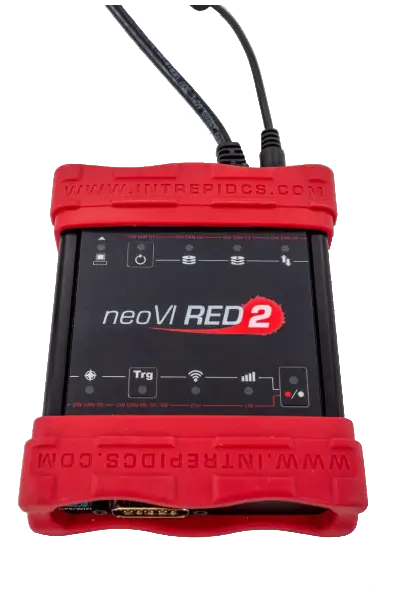
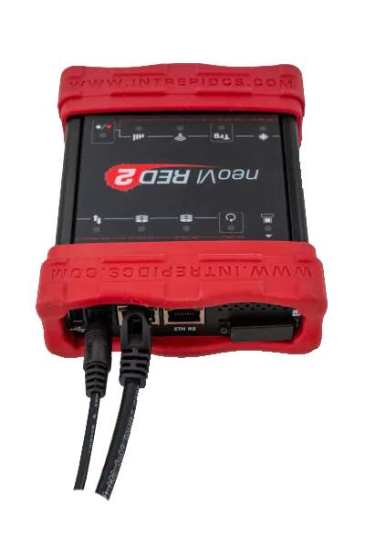
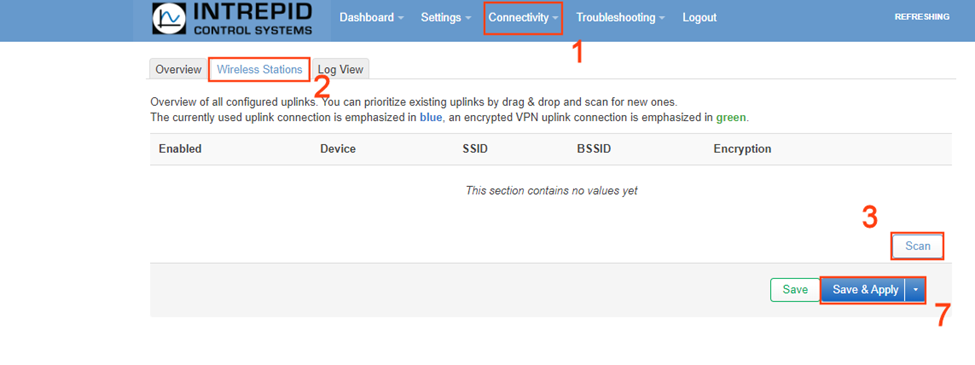
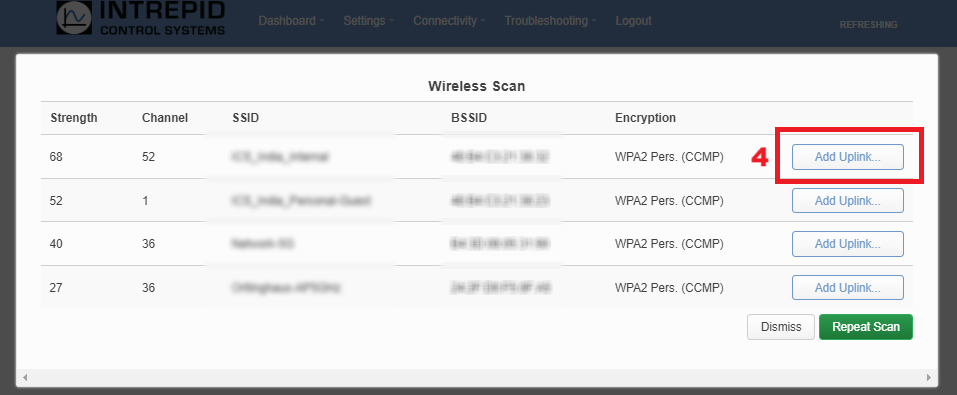
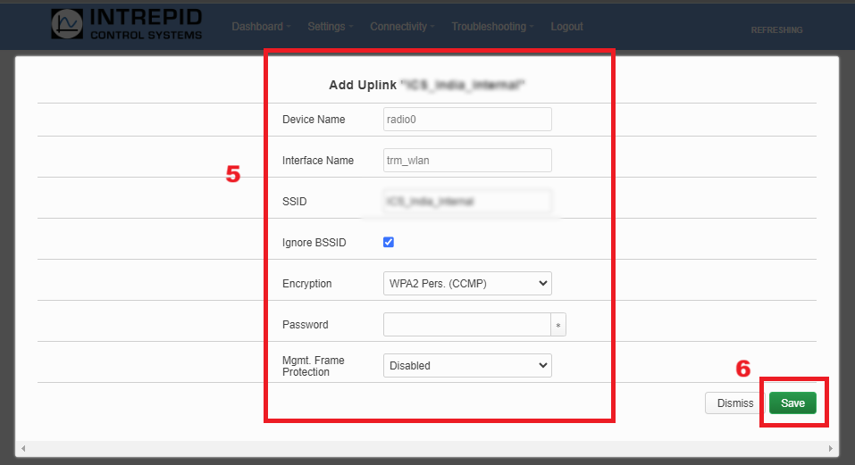
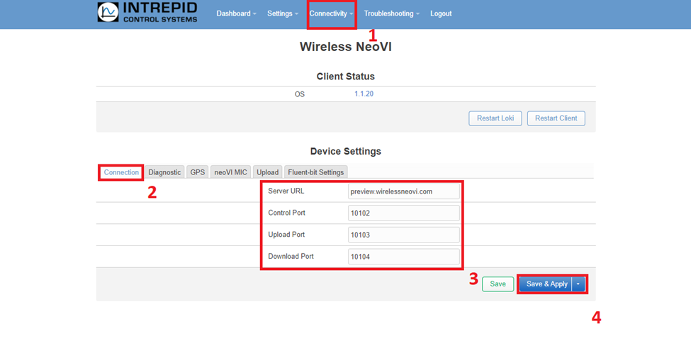

# 2. Device Configuration

This document serves as a comprehensive guide for configuring Linux on neoVI hardware with native support for Wireless neoVI functionalities. It offers step-by-step instructions for installing the Linux operating system on the designated device, accompanied by detailed guidance on configuring settings tailored specifically for seamless integration with Wireless neoVI or WiVI.

## 2.1 Hardware Setup {#hardware-setup}

This section will explore both ways to get the neoVI [CONNECT](https://intrepidcs.com/products/data-loggers/ruggedized-ip67-data-logger-neovi-connect/) / [RED2](https://intrepidcs.com/products/vehicle-network-adapters/neovi-red-2/) / [FIRE3](https://intrepidcs.com/products/vehicle-network-adapters/neovi-fire-3-canfd-lin-ethernet-vehicle-interface-wireless-datalogger/) hardware setup

### 2.1.1 Setup Device Connection {#setup-device-connection}

> Connect the included ethernet cable to the ‘ETH 02’ port on the Intrepid neoVI hardware. Connect the other end of the ethernet cable to your PC. 

<figure>

<figcaption>neoVI RED 2 Device</figcaption>
</figure>

### 2.1.2 Setup in neoVI Explorer {#setup-in-neovi-explorer}

In the Windows Search Bar, search for `neoVI Explorer` and open the program.

1. In neoVI Explorer, connect to the Intrepid Hardware  
2. Open the "Linux Settings" menu.
3. In Linux Settings, change the "Configuration Port" to "ETH 01"
4. Click "Write Settings." (**Note** - After applying the **Write Settings**, the respective device requires a reboot)

<figure>

<figcaption>Setup in neoVI Explorer</figcaption>
</figure>

Once this is done, power cycle the device, and plug into ‘ETH 01.’ The configuration port is now ready.

<figure>

<figcaption></figcaption>
</figure>

<figure>

<figcaption></figcaption>
</figure>

## 2.2 Configure Settings {#configure-settings}

Once that is setup and Linux is installed, the hardware can be logged into.  This is using the same configuration above.

### 2.2.1 Wifi Setup {#wifi-setup}

Open a browser and type in the address `http://192.168.200.2`. A login prompt will appear.

The user name is **‘root’**

The password is the serial number of the hardware.  This is just like the password in the command line steps.

**To setup the Wifi….**

1. Go to Connectivity \-\> Wifi Settings  
2. Select Wireless Stations tab  
3. Click Scan  
4. Select wireless network with a strength of at least 30 by clicking on “Add Uplink…”   
5. In the Add Uplink menu, enter credentials and encryption details.  
6. Once the settings are correct, click Save.  
7. Click Save & Apply.

This could take up to a minute to connect the first time. 

<figure>

<figcaption></figcaption>
</figure>

<figure>

<figcaption></figcaption>
</figure>

<figure>

<figcaption></figcaption>
</figure>

### 2.2.2 Server Setup {#server-setup}

 Next is to set up the server connection. 

1. Go to Connectivity → Wireless neoVI settings   
2. On the Connection tab, verify and Set the following  
   * Server URL \= (exampleserver).wirelessneovi.com  
   * Control Port: 10102  
   * Upload Port: 10103  
   * Download Port: 10104   
3.  Click Save and Apply 

<figure>

<figcaption></figcaption>
</figure>

Once this is done, the Wireless neoVI settings are properly configured, and the server is ready to be connected to.