# 2. Device Configuration

This document serves as a comprehensive guide for configuring Linux on neoVI hardware with native support for Wireless neoVI functionalities. It offers step-by-step instructions for installing the Linux operating system on the designated device, accompanied by detailed guidance on configuring settings tailored specifically for seamless integration with Wireless neoVI or WiVI.

## 2.1 Hardware Setup {#hardware-setup}

This section will explore both ways to get the neoVI [CONNECT](https://intrepidcs.com/products/data-loggers/ruggedized-ip67-data-logger-neovi-connect/) / [RED2](https://intrepidcs.com/products/vehicle-network-adapters/neovi-red-2/) / [FIRE3](https://intrepidcs.com/products/vehicle-network-adapters/neovi-fire-3-canfd-lin-ethernet-vehicle-interface-wireless-datalogger/) hardware setup

### 2.1.1 Setup Device Connection {#setup-device-connection}

> Connect the included ethernet cable to the ‘ETH 02’ port on the Intrepid neoVI hardware. Connect the other end of the ethernet cable to your PC. 

<figure>

<figcaption>neoVI RED 2 Device</figcaption>
</figure>

### 2.1.2 Setup in neoVI Explorer {#setup-in-neovi-explorer}

In the Windows Search Bar, search for `neoVI Explorer` and open the program.

1. In neoVI Explorer, connect to the Intrepid Hardware  
2. Open the "Linux Settings" menu.
3. In Linux Settings, change the "Configuration Port" to "ETH 01"
4. Click "Write Settings."

<figure>

<figcaption>Setup in neoVI Explorer</figcaption>
</figure>

Once this is done, power cycle the device, and plug into ‘ETH 01.’ The configuration port is now ready.

<figure>

<figcaption></figcaption>
</figure>

<figure>

<figcaption></figcaption>
</figure>

## 2.2 Software Setup {#software-setup}

This software setup guide will show you how to use Linux in the neoVI hardware. This guide will walk through installing Linux onto the device, as well as configuring settings for Wireless neoVI (WiVi). 

### 2.2.1 Check Linux Version in Device {#check-linux-version-in-device}

Updating Linux in the neoVI devices is different depending on the Linux version loaded in the device. To check the version of Linux:

1. Connect power to the neoVI device and wait at least 60 seconds for Linux to boot.  
2. Connect to the ETH02 port on the neoVI device for PC configuration.  
3. Open neoVI Explorer by searching for `neoVI Explorer` in the Windows Search Bar.  
4. In neoVI Explorer, select the device from the list on the left and press **Connect**.  
5. In the expanded list on the left, select **Linux Settings** and press the **Get Version** button to get the Linux version loaded in the device.  
6. While in this view, please verify that **Configuration Port** is set to **None**. 

If the Linux version appears as `1.0.22` or `1.2`, this suggests that the version of Linux is too old to flash with .IUP files and needs to be **updated via SSH first**. 

If the Linux version is `1.0.27`, `1.0.28`, or `1.1.20`, the Linux version in the device is new enough to support **`.IUP file flashing`**, and the next section of this guide can be skipped.

### 2.2.2 Updating firmware {#updating-firmware}

**For Versions 1.2 and 1.0.22**

Install the Linux SSH update package below:

[Click to download the WiVi package file](https://cdn.intrepidcs.net/wivi/red2/1.0/v1.0.28.zip) 

First, download the `.zip` file, and extract `v1.0.28` to Root `C:\`. To extract this file, right click and select Extract Files… Select the root `C:\` drive, and press Extract.  

A folder labelled `v1.0.28` will be in the root `C:\` directory. Two folders are in this directory, `f3-flash` and `f3-update`.  Matching this location will allow copy-pasting of the update commands below. 

Connect the RealTek USB ethernet adapter to the USB port on the neoVI RED 2/FIRE3.  Connect the PC's ethernet to the RealTek USB ethernet adapter. 

(NOTE: This must be a RealTek USB to Ethernet PHY to talk to older versions of Linux in the neoVI RED2/FIRE3. For steps to check whether USB to Ethernet adapter is RealTek, refer to the [troubleshooting section](\#troubleshooting-linux-installation))

<figure>

<figcaption>Extracting the v1.0.28 package from the Downloads folder to the C: drive.</figcaption>
</figure>

### 2.2.3 SSH into the Hardware {#ssh-into-the-hardware}

Open Command Prompt with Admin rights.  (Type CMD in the Start Menu, right click on Command prompt and choose Run as Administrator).  The quotes should be able to be copy-pasted, if extracted to root `C:\`

<figure>

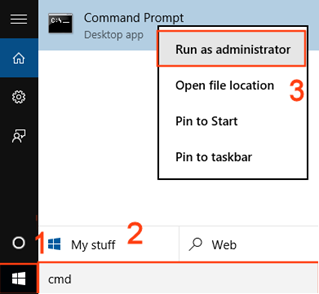
<figcaption></figcaption>
</figure>

If asked for a password, it is the serial number of the hardware.  The password is not displayed while it is typed, but it is still entered. The command below will move to the right directory.  

`cd c:\\v1.0.28`

This will copy the update package over. (If this command fails, see '**WARNING: REMOTE HOST**' step below)

`scp \-r f3-update/ root@192.168.200.2:/tmp/`

If a '**WARNING: REMOTE HOST IDENTIFICATION HAS CHANGED\!**' alert appears, enter:

`ssh-keygen \-R 192.168.200.2`

<figure>

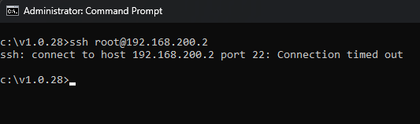
<figcaption></figcaption>
</figure>

If you encounter the following error, make sure [SSH access is configured](\#ssh-access) using the tutorial linked.

The command below will make the update file an executable.

`ssh root@192.168.200.2 chmod +x /tmp/f3-update/f3-update`
 
The final command runs the update.

`ssh root@192.168.200.2 /tmp/f3-update/f3-update`

The hardware will now run through the update. Numerous update lines will appear below the command, wait for this to finish.  Once the prompt appears again, disconnect power to the hardware and wait for 5 seconds. Connect power to the device again.  Give the hardware about 30 seconds before moving on.  

To verify the update was successful, run the command below.  This will ask for the password.

`ssh root@192.168.200.2 cat /etc/ics-release`
 
1.0.28 should appear.  If that checks out, the Linux installation is set!

<figure>

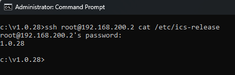
<figcaption></figcaption>
</figure>

Once this is done, run the following command to clear the wireless settings.

`ssh root@192.168.200.2 rm \-rf /overlay`

After running the command above you should receive the following output  

<figure>

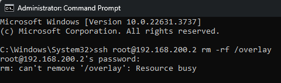
<figcaption></figcaption>
</figure>

**IMPORTANT: Be sure to power cycle the device after clearing the wireless settings.**

### 2.2.4 Push .IUP file to device {#push-iup-file-to-device}

Now that the device has a newer version of Linux, the latest .IUP flash file can be loaded to the device.

Install the latest .IUP flash file from the link below (Please use 1.1.20, **1.3.7 can only be pushed over the Wireless neoVI Server**):

[https://cdn.intrepidcs.net/wivi/red2/](https://cdn.intrepidcs.net/wivi/red2/)

The first step for updating Linux in the hardware is verifying the correct settings in neoVI Explorer to connect to the hardware.  Power on the neoVI hardware and connect it to the PC using ETH2.

Are any firmware versions appearing in red? If the firmware versions are appearing in red, please press the ‘Manual Reflash’ button to update the firmware to the correct values for your DLL version. They should now appear in black.

<figure>

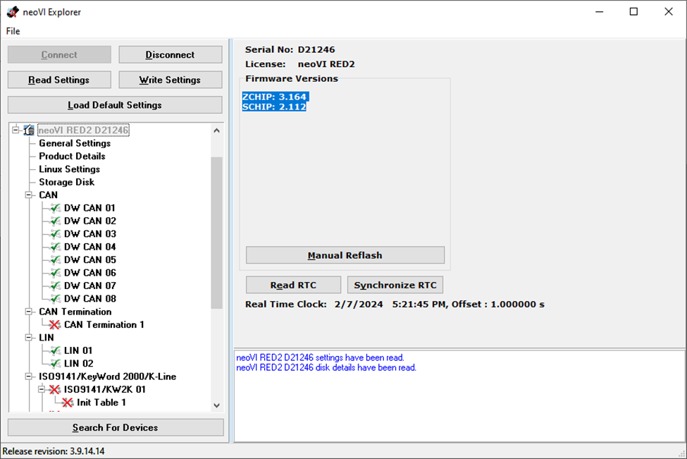
<figcaption></figcaption>
</figure>

In the tree on the left, click on “Linux Settings”. This will show the current version as well as the configuration port.  Set the Configuration port to “ETH01” if it isn’t already. Power cycle after changing this setting.

<figure>

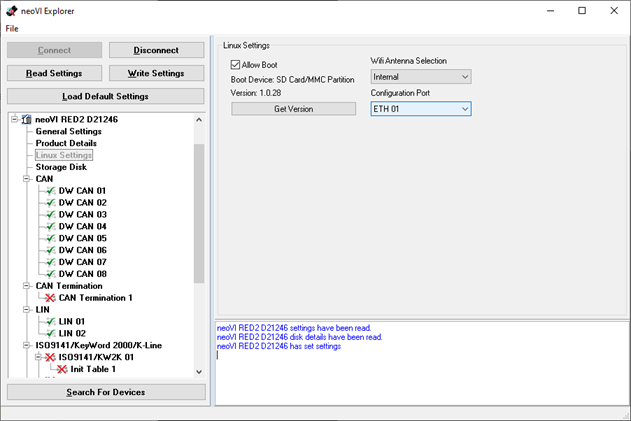
<figcaption></figcaption>
</figure>

Next, navigate to ‘Storage Disk’ and select ‘Format Disk’ to format the SD card, and remove any existing data. 

<figure>

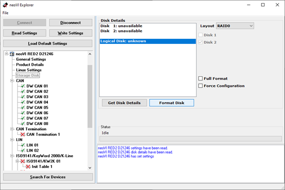
<figcaption></figcaption>
</figure>

After this, click on Write settings, disconnect, and power cycle the hardware. 

Disconnect the hardware from ETH02 and connect to ETH01.  Wait at least 1 minute for Linux to boot and open a web browser.  Enter “192.168.200.2” into the URL (search) bar of the browser.  Enter in the user name and password.  Default is “root” for the username and the serial number of the hardware, all upper case, for the password.  This is the same portal for configuring Wireless neoVI. 

In the web portal, navigate to Settings → Flash Firmware.  The ‘Update Image’ button gives a File Open dialog to select the **\*.IUP** downloaded above.  Select the file and click Upload.  

<figure>

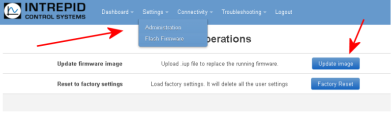
<figcaption></figcaption>
</figure>

When the upload is complete, it will automatically begin the device update.  Do not power off the device during this step.  

<figure>

<figcaption></figcaption>
</figure>

Once finished, the portal will prompt for a power cycle. Click the button and wait for the device to reconnect.  

<figure>

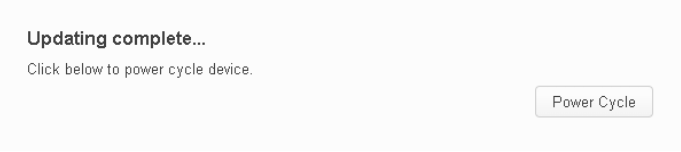
<figcaption></figcaption>
</figure>

Log into the portal, just as before. The top of the page will have the “OS” version.  It should match the version of the \*.IUP file loaded (ex. 1.1.20).

Once we have the latest version of Linux loaded in the device, we can verify that there is not two scan buttons in the wireless connection screen by navigating to ‘Connectivity\>\>Wireless’ and checking for two ‘Scan’ buttons. 

<figure>

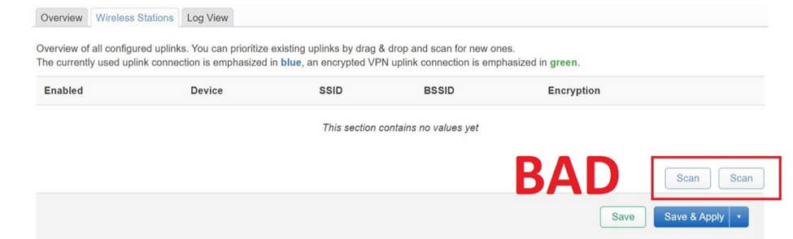
<figcaption></figcaption>
</figure>

If there are two scan buttons, this suggests that something is wrong with the Linux installation, and we will need to factory reset the device. To do this, navigate to ‘Settings\>\>Factory Reset’ and factory reset your device. 

<figure>

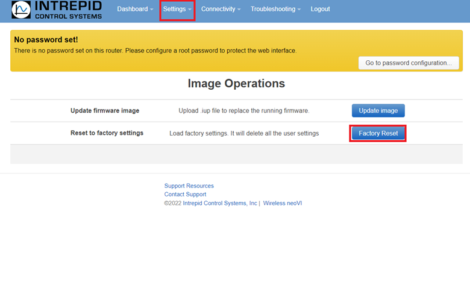
<figcaption></figcaption>
</figure>

### 2.2.5 Update Linux Installation from WiVI Server {#update-linux-installation-from-wivi-server}

If you are pushing the latest .IUP file to the device, you can get the file here (Use files newer than 1.0.28):

[https://cdn.intrepidcs.net/wivi/red2/](https://cdn.intrepidcs.net/wivi/red2/)

Open the URL of the desired Wireless neoVI server and go to the page of the desired device/vehicle. With the desired device/vehicle selected, press ‘Send Script or Update.’

<figure>

<figcaption></figcaption>
</figure>

In the new window that appears, select the desired update file, and press ‘Upload.’

<figure>

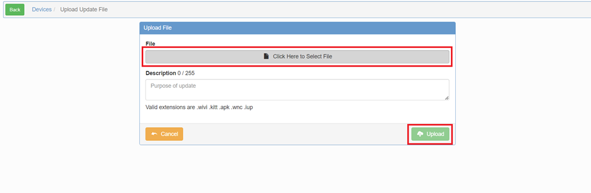
<figcaption></figcaption>
</figure>

Follow the prompts to send the file to the hardware device, and the file will successfully upload\! 

(NOTE: You may need to factory reset the device again, if the two ‘Connectivity\>\>Wireless\>Wireless Stations’ ‘Scan’ buttons are present)

### 2.2.6 – Troubleshooting Linux Installation {#troubleshooting-linux-installation}

To verify that the USB to Ethernet Adapter has a **RealTek chip**:

1. Plug the adapter into a Windows PC, and search for ‘Control Panel’ in the Windows Search Bar, and open the Control Panel.  
2. In Control Panel, select ‘Network and Internet’ and select the ‘Network and Sharing Center.’  
3. On the left hand side of the window, select ‘Change adapter settings’ and observe the network adapters.

<figure>

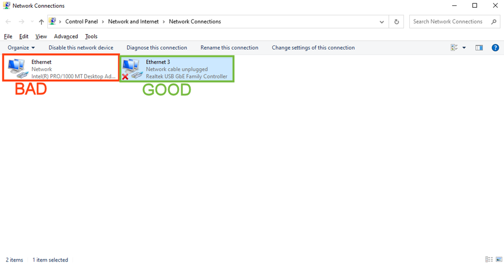
<figcaption>Picture above shows USB to Ethernet adapter with a RealTek chip</figcaption>
</figure>

Once all of these steps are completed, check the ‘Dashboard\>\>Log View’ for both WiVi and the Network. Troubleshooting steps are listed below.

**1. SSH Connection Refused In Windows Command Prompt:**

> Navigate to the web portal by entering `http://192.168.200.2` into the search bar and entering the device serial number as the password. Navigate to ‘Settings\>\>Administration’ and click the ‘SSH Access’ tab. Delete any current settings, press ‘New’ then save and apply settings.

**2. Wireless is refusing to connect (Visible in the problem log):**

> Navigate to ‘Connectivity\>\>WiFi Settings’, and select Restart interface.

**3. WiVi is refusing to connect (Visible in the problem log):**

> Navigate to ‘Connectivity\>\>Wireless neoVI’ and restart both Loki Agent and WiVi Client.

**4.  Wireless radio is ‘radio1’ instead of ‘radio0’ by default:**

> Navigate to ‘Settings\>\>Flash Firmware’ and select Factory Reset.

## 2.3 – Configure Settings {#configure-settings}

Once that is setup and Linux is installed, the hardware can be logged into.  This is using the same configuration above.  The ethernet cable from that adapter can be connected to the PC to configure it.   

### 2.3.1 – Wifi Setup {#wifi-setup}

Open a browser and type in the address `http://192.168.200.2`. A login prompt will appear.

The user name is **‘root’**

The password is the serial number of the hardware.  This is just like the password in the command line steps.

**To setup the Wifi….**

1. Go to Connectivity \-\> Wifi Settings  
2. Select Wireless Stations tab  
3. Click Scan  
4. Select wireless network with a strength of at least 30 by clicking on “Add Uplink…”   
5. In the Add Uplink menu, enter credentials and encryption details.  
6. Once the settings are correct, click Save.  
7. Click Save & Apply.

This could take up to a minute to connect the first time. 

<figure>

<figcaption></figcaption>
</figure>

### 2.3.2 – Server Setup {#server-setup}

 Next is to set up the server connection. 

1. Go to Connectivity → Wireless neoVI settings   
2. On the Connection tab, verify and Set the following  
   * Server URL \= (exampleserver).wirelessneovi.com  
   * Control Port: 10102  
   * Upload Port: 10103  
   * Download Port: 10104   
3.  Click Save and Apply 

<figure>

<figcaption></figcaption>
</figure>

### 2.3.3 – SSH Access {#ssh-access}

The final item to set up is SSH Access

1. Select Settings → Administration  
2. Go to the SSH Access tab  
3. If the text “this section contains no values yet” is present, click the Add instance button  
4. If not, click on Delete, then hit the Add instance button (leave default)  
5. Save and Apply

<figure>

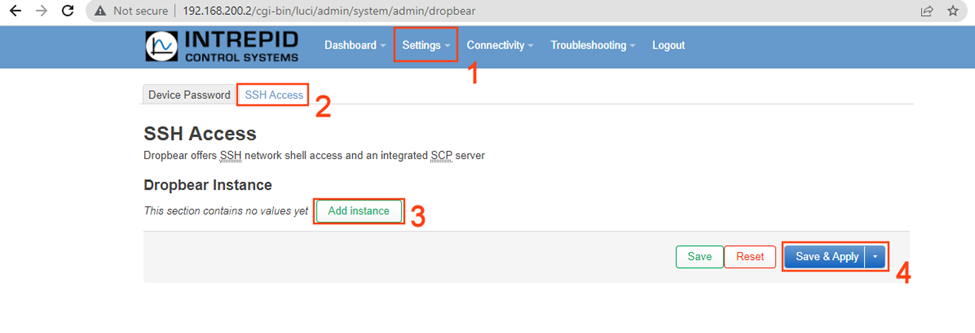
<figcaption></figcaption>
</figure>

Once this is done, Linux is properly configured, and ready to be connected to.