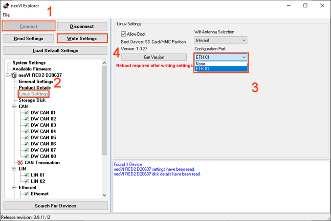

# 2. Device Configuration

This document serves as a comprehensive guide for configuring Linux on neoVI hardware with native support for Wireless neoVI functionalities. It offers step-by-step instructions for installing the Linux operating system on the designated device, accompanied by detailed guidance on configuring settings tailored specifically for seamless integration with Wireless neoVI or WiVI.

## 2.1 Hardware Setup {#hardware-setup}

This section will explore both ways to get the neoVI [CONNECT](https://intrepidcs.com/products/data-loggers/ruggedized-ip67-data-logger-neovi-connect/) / [RED2](https://intrepidcs.com/products/vehicle-network-adapters/neovi-red-2/) / [FIRE3](https://intrepidcs.com/products/vehicle-network-adapters/neovi-fire-3-canfd-lin-ethernet-vehicle-interface-wireless-datalogger/) hardware setup

### 2.1.1 Setup Device Connection {#setup-device-connection}

> Connect the included ethernet cable to the ‘ETH 02’ port on the Intrepid neoVI hardware. Connect the other end of the ethernet cable to your PC. 

<figure>

<figcaption>neoVI RED 2 Device</figcaption>
</figure>

### 2.1.2 Setup in neoVI Explorer {#setup-in-neovi-explorer}

In the Windows Search Bar, search for `neoVI Explorer` and open the program.

1. In neoVI Explorer, connect to the Intrepid Hardware  
2. Open the "Linux Settings" menu.
3. In Linux Settings, change the "Configuration Port" to "ETH 01"
4. Click "Write Settings."

<figure>

<figcaption>Setup in neoVI Explorer</figcaption>
</figure>

Once this is done, power cycle the device, and plug into ‘ETH 01.’ The configuration port is now ready.

<figure>

<figcaption></figcaption>
</figure>

<figure>

<figcaption></figcaption>
</figure>

## 2.2 Software Setup {#software-setup}

This software setup guide will show you how to use Linux in the neoVI hardware. This guide will walk through installing Linux onto the device, as well as configuring settings for Wireless neoVI (WiVi). 

### 2.2.1 Check Linux Version in Device {#check-linux-version-in-device}

Updating Linux in the neoVI devices is different depending on the Linux version loaded in the device. To check the version of Linux:

1. Connect power to the neoVI device and wait at least 60 seconds for Linux to boot.  
2. Connect to the ETH02 port on the neoVI device for PC configuration.  
3. Open neoVI Explorer by searching for `neoVI Explorer` in the Windows Search Bar.  
4. In neoVI Explorer, select the device from the list on the left and press **Connect**.  
5. In the expanded list on the left, select **Linux Settings** and press the **Get Version** button to get the Linux version loaded in the device.  
6. While in this view, please verify that **Configuration Port** is set to **None**. 

If the Linux version appears as `1.0.22` or `1.2`, this suggests that the version of Linux is too old to flash with .IUP files and needs to be **updated via SSH first**. 

If the Linux version is `1.0.27`, `1.0.28`, or `1.1.20`, the Linux version in the device is new enough to support **`.IUP file flashing`**, and the next section of this guide can be skipped.

### 2.2.2 Updating firmware {#updating-firmware}

**For Versions 1.2 and 1.0.22**

Install the Linux SSH update package below:

[Click to download the WiVi package file](https://cdn.intrepidcs.net/wivi/red2/1.0/v1.0.28.zip) 

First, download the `.zip` file, and extract `v1.0.28` to Root `C:\`. To extract this file, right click and select Extract Files… Select the root `C:\` drive, and press Extract.  

A folder labelled `v1.0.28` will be in the root `C:\` directory. Two folders are in this directory, `f3-flash` and `f3-update`.  Matching this location will allow copy-pasting of the update commands below. 

Connect the RealTek USB ethernet adapter to the USB port on the neoVI RED 2/FIRE3.  Connect the PC's ethernet to the RealTek USB ethernet adapter. 

(NOTE: This must be a RealTek USB to Ethernet PHY to talk to older versions of Linux in the neoVI RED2/FIRE3. For steps to check whether USB to Ethernet adapter is RealTek, refer to the [troubleshooting section](\#troubleshooting-linux-installation))

<figure>

<figcaption>Extracting the v1.0.28 package from the Downloads folder to the C: drive.</figcaption>
</figure>

