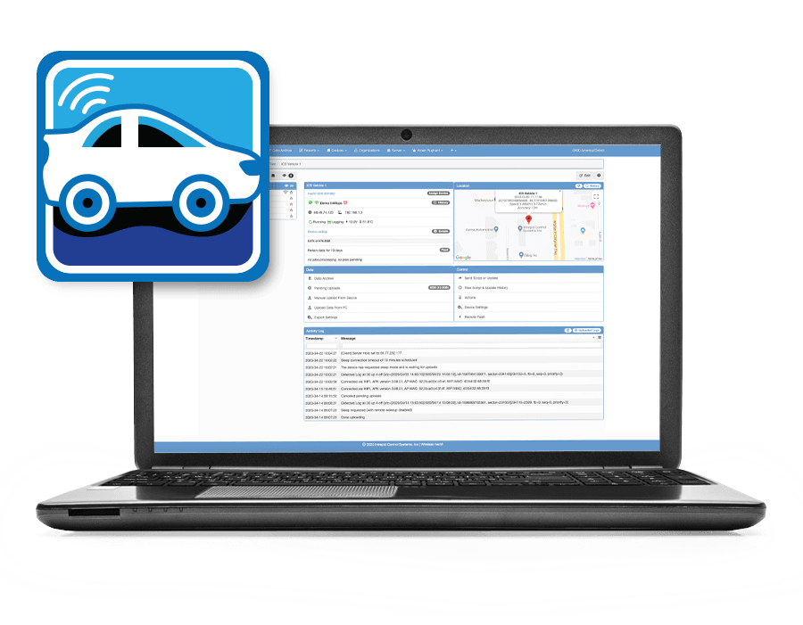

# Welcome to the Wireless neoVI Help Documentation

<figure>

<figcaption>This documentation was created to help Wireless neoVI users at every level of experience.</figcaption>
</figure>

## Contents:

<!-- ## **[(1) Introduction and Overview](/introduction-and-overview/)** -->

 

<h3><a href="/introduction-and-overview/"> (1) Introduction and Overview</a></h3>
<h3><a href="#"> (2) Device Configuration</a></h3>
<h3><a href="#"> (3) Wireless neoVI</a></h3>

