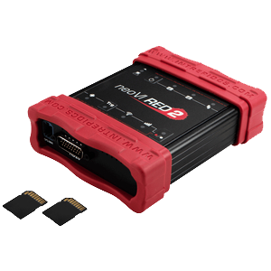
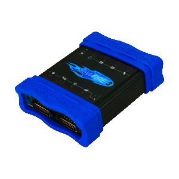
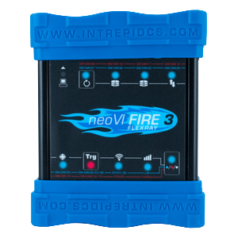

# 1. Introduction and Overview

## 1.1 Overview {#overview}

Wireless neoVI is a comprehensive website and server software solution facilitating seamless management of both automatic and manual remote data download, control, and monitoring processes. Its meticulously crafted user interface ensures a streamlined and intuitive interaction with your fleet of loggers.

## 1.2 Specifications {#specifications}

**Wireless neoVI Software Includes:**

- Fleet management server software for Intrepid [data loggers](https://intrepidcs.com/products/data-loggers/)
- Google Maps GPS vehicle tracking
- A collected data repository
- Remote device control and configuration
- Live data analytics
- Hardware maintenance and warranty of connected hardware
- One year of Wireless neoVI software

**Wireless neoVI Software Features:**

* Remotely capture and download data logging file
* Remotely activate, deactivate, and reprogram data loggers
* Remotely post-process multiple sets of data
* Run on Intrepid’s servers or independently on your own
* Control loggers from a web portal on your PC or mobile device
* Manage your fleet with automated on-demand reporting, dynamic issues management, and vehicle management for the transportation and construction industries
* Track your fleet with geo-fencing, location reporting, and historical GPS reports

## 1.3 Deployment Requirements {#deployment-requirements}

Wireless neoVI can be deployed in two main configurations: hosted on Intrepid’s private environment or deployed internally within your organization's infrastructure. Both deployment options aim to provide flexibility and security while meeting the diverse needs of our users. Choose the deployment option that best fits your organization's requirements and resources. Below are details about each deployment option:

**Hosted Deployment**

Wireless neoVI is deployed to our private hosting environment as part of our standard Software as a Service (SaaS) package. This deployment option includes the following features:

  - Monitoring - All services related to Wireless neoVI are monitored to ensure uptime and performance.
  - Backups - Regular backups of the database are performed to prevent data loss.
  - Security - All web connections to Wireless neoVI are secured using TLS v1.2 encryption to protect your data in transit.

**Customer-hosted Deployment**

Alternatively, customers have the flexibility to deploy Wireless neoVI internally within their own environment. This deployment option allows you to have greater control over your infrastructure and data.

Intrepid Control Systems, Inc. is not responsible for providing support for the hardware or operating system of customer-hosted servers. It is the customer's responsibility to ensure that their infrastructure meets the necessary requirements for running Wireless neoVI effectively.

## 1.4 Hardware Requirements {#hardware-requirements}

**Vehicle Network Interface Hardware**

Wireless neoVI supports the [neoVI RED2](https://intrepidcs.com/products/vehicle-network-adapters/neovi-red-2/), [neoVI FIRE3](https://intrepidcs.com/products/vehicle-network-adapters/neovi-fire-3-canfd-lin-ethernet-vehicle-interface-wireless-datalogger/), and the neoVI ION (This product is obsolete. The substitute is [NEOVI FIRE 3](https://intrepidcs.com/products/vehicle-network-adapters/neovi-fire-3-canfd-lin-ethernet-vehicle-interface-wireless-datalogger/) and [NEOVI RED 2](https://intrepidcs.com/products/vehicle-network-adapters/neovi-red-2/)) specifically designed and manufactured by Intrepid Control Systems for vehicle networks. These interfaces are seamlessly integrated with Wireless neoVI, ensuring high compatibility and functionality. 

|   	                                                                                                                                                            |                                                                                                                                                                                                                                                                                                     |
|---------------------------------------------------------------------------------------------------------------------------------------------------------------	|----------------------------------------------------------------------------------------------------------------------------------------------------------------------------------------------------------------------------------------------------------------------------------------------	      |
|                                                                | **neoVI RED 2 Vehicle Interface**   Recommended for: **DW CAN, ISO9141, LIN, and J1939**   More information here: [neoVI RED 2](https://intrepidcs.com/products/vehicle-network-adapters/neovi-red-2/)                                                                             	      |
|   	| **neoVI FIRE 3 Vehicle Interface**   Recommended for: **CAN/CAN FD, GMLAN, ISO9141, OBD-II, LIN, and J1939**   More information here: [neoVI FIRE3](https://intrepidcs.com/products/vehicle-network-adapters/neovi-fire-3-canfd-lin-ethernet-vehicle-interface-wireless-datalogger/)        |
|   	                                | **neoVI FIRE 3 FlexRay Vehicle Interface**   Recommended for: **CAN/CAN FD, SWCAN, GMLAN, ISO9141, OBD-II, LIN, and J1939**   More information here: [neoVI FIRE3 FlexRay](https://intrepidcs.com/products/vehicle-network-adapters/neovi-fire-3-flexray/)                                  |

 

  - Integration - Each hardware interface is deeply integrated with Wireless neoVI, providing seamless communication and operational efficiency within vehicle networks.
  - Compatibility - Designed specifically for vehicle networks, these interfaces ensure compatibility with Wireless neoVI’s software ecosystem, enhancing overall system performance.
  - Support - Wireless neoVI provides comprehensive support for these hardware interfaces, ensuring smooth integration and reliable operation.

## 1.5 Server Requirements {#server-requirements}

**CPU**

CPU requirements for Wireless neoVI depend on the size and frequency of device data offloads, export options used during data processing, and whether any custom processing is implemented. As each customer’s installation has specific needs and the number of Wireless neoVI enabled devices can increase over time, determining the ideal CPU count can be challenging. However, we recommend a minimum of 6 CPU cores as a starting point.

To accommodate various environments, the number of concurrent data processing jobs in Wireless neoVI’s configurable and can be scaled accordingly. Utilizing virtualization technologies offers flexibility in scaling server performance as the fleet of devices grows.

Starting with a 6-core processor is recommended as a baseline configuration, which performs well for most installations. This setup allows for up to 4 data processing jobs to run concurrently. If there is a need to increase the number of concurrent jobs, it is advisable to increase the number of CPU cores accordingly.

**RAM**

On Linux hosts, the recommended minimum RAM is 16-24 GB for small to moderate fleets of devices. This amount should be scaled up as fleet sizes grow larger to ensure optimal performance and accommodate increased data processing demands.

**Hard Disk**

The hard disk requirements for Wireless neoVI are influenced by several factors including:
  - Number of logging devices
  - Time duration of logging
  - Data retention period
  - Amount of data collected per session
  - Selected data export formats
  - Custom processing requirements

As a starting point, we recommend allocating 1TB of data storage space. This capacity can be adjusted and scaled up as your fleet grows in size or as your data retention needs evolve.

While not required, we strongly encourage implementing a RAID configuration for disk redundancy. This helps protect against data loss in the event of a disk failure.

We advise against using NFS (Network File System) or CIFS (Common Internet File System) network shares for storing Wireless neoVI data. These network storage solutions can be unreliable due to improper configurations or high network latency, which may lead to data loss or data corruption.

## 1.6 Software Requirements {#software-requirements}

**Operating System**

Wireless neoVI is compatible with any modern Linux-based Operating System that runs kernel version 4.15 or higher. Specifically, WiVI usage has been tested and verified on Debian 11 among Linux distributions.

While Wireless neoVI can operate on most modern Linux distributions with kernel 4.15 or newer, it is recommended that the distribution runs on at least **kernel version 5.4 or newer**.

Please note that Docker is necessary for deploying all new releases of ICS web-based software, including WiVI, Dataspy, and IPA. 

The server's time zone and clock must be configured to UTC. Server time synchronization using NTP (Network Time Protocol) is essential to prevent time drift, which can adversely affect the processing of device data collections.

**Database**

Wireless neoVI works with the following database engines:
  - MySQL 5.5 - 5.7
  - MariaDB 5.5 - 10.3

## 1.7 Additional Requirements {#additional-requirements}

Wireless neoVI is deployed in containers utilizing docker and the docker-compose(v2) plugin
which requires Docker (v19.03+)

## 1.8 Custom Programming and Scripting {#custom-programming-and-scripting}

Wireless neoVI supports custom data processing and data handling.
Frequently used languages for custom options that need to be installed:

  - Python 3.8+