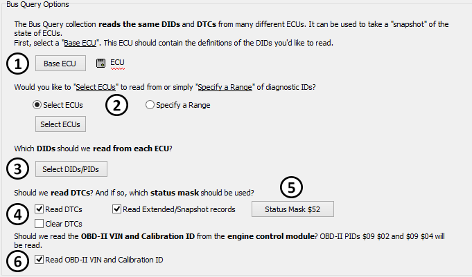
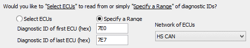
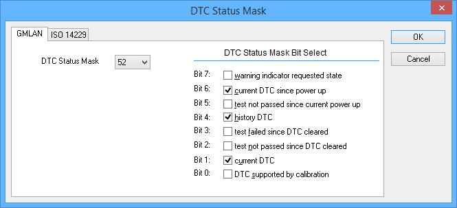

# Collections and Methods: Bus Query Method

In VehicleScape DAQ the [Standalone Logging](./../../../vehiclescape-daq-standalone-logging-tab/) of a Bus Query [collection](./../../standalone-logging-collections-and-methods/) allows you to log a snapshot of DID/PID values and DTCs at a point in time. This can be done with a single ECU or several ECUs at once.

The options for the Bus Query collection method are broken into five subsections: **Bus Query Options, Start Options, Stop Options, Restart Options** and **Upload to Wireless neoVI**. Each of the subsections is described below.

Four of the subsections are identical or similar to subsections used in the [Message Capture](./../collections-and-methods-message-capture-method/) method, so reference is made to help topics in that area where relevant.

The [Status Reporting](./../../standalone-logging-status-reporting/), [Power Management](./../../standalone-logging-power-management/) and [Generation Options](./../../standalone-logging-generation-options/) sections in the bottom half of the Standalone Logging Tab apply to all method types, including the [Bus Query](./../collections-and-methods-bus-query-method/), [Message Capture](./../collections-and-methods-message-capture-method/), [Histogram](./../collections-and-methods-histogram-method/) and [Ethernet DAQ](./../collections-and-methods-ethernet-daq-method) methods.

## Bus Query Options

This is where the primary settings to control data collection for the bus query can be found (Figure 1).

<figure>

<figcaption>Figure 1: Bus Query Options for the VehicleScape DAQ Standalone Logging Bus Query collection method</figcaption>
</figure>

## Base ECU

Begin by selecting the base ECU, which contains the definitions of the DIDs you want to read (Figure 1: ).

## Select ECUs / DID Range

You can choose to read from selected ECUs or specify a range of DIDs (Figure 1: ):

* **Select ECUs:** This is the default option; click the **Select ECUs** button to choose them.
* **Specify a Range:** When you choose this option, additional parameters will appear, as shown in Figure 2. Enter the start and end arbitration IDs for the range you want to collect from, and use the **Network of ECUs** drop-down box to change the network if necessary.

<figure>

<figcaption>Figure 2: DID range options for the Bus Query collection.</figcaption>
</figure>

## Select DIDs/PIDs

Press the **Select DIDs/PIDS** button to choose the DIDs/PIDs you want to read from each ECU (Figure 1: ).

## Read DTCs / Status Mask

There are three options to control the reading of DTCs (Figure 1: ):

* **Read DTCs:** Log all DTCs from all chosen ECUs if the DTC passes the Status Mask filter. (This must be checked or the other options here will be grayed out.)
* **Clear DTCs:** Clear DTCs after they have been read.
* **Read Extended/Snapshot Records:** Include the DTC extended (ISO $19/06) and DTC snapshot (ISO $19/04) records.

The **Status Mask** button (Figure 1: ) shows the current DTC status bit mask in hexadecimal form. To change the mask, click the button and a dialog will appear allowing you to select the mask bits (Figure 3).

<figure>

<figcaption>Figure 3: DTC Status Mask dialog box.</figcaption>
</figure>

## Read OBD-II VIN and Calibration ID

Select this option (Figure 1: ) to use J1979 mode $09 to log the VIN (PID $02) and engine control module calibration ID (PID $04).

## Start Options

The Bus Query method always uses the **Start using trigger expression** Start Option. [Selecting triggers and triggering events is the same as in the Message Capture method](../collections-and-methods-message-capture-method/message-capture-method-start-options).

The **Always DAQ** option is always enabled.

## Stop Options

The Bus Query method uses the same [One-shot Report Stop Options in the Message Capture method](./../message-capture-method-stop-options/message-capture-method-stop-options-one-shot-report/).

## Restart Options

There are three restart options:

* **Do not restart the collection when finished:** End the capture after data has been collected.
* **Restart the collection when finished:** Start capturing again after data collection when the trigger expression is again true.
* **Force Restart (do not wait for start expression):** Start capturing again immediately after data collection without waiting for the trigger expression to become true.

## Upload to Wireless neoVI

These options are [the same as for the Message Capture method](../message-capture-method-upload-to-wireless-neovi/).