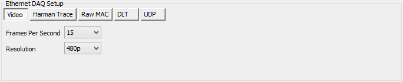
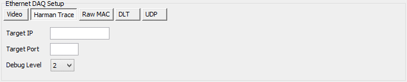
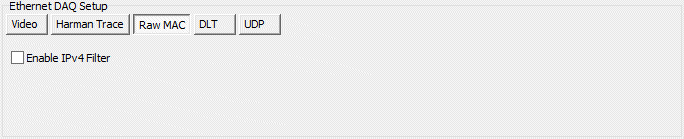
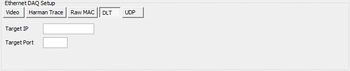
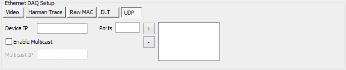

# Collections and Methods: Ethernet DAQ Method

In VehicleScape DAQ the [Standalone Logging](./../../../vehiclescape-daq-standalone-logging-tab/) of an Ethernet DAQ [collection](./../../standalone-logging-collections-and-methods/) allows you to log data using the Ethernet DAQ port on supported Intrepid neoVI hardware.

There are five different submethods that can be selected using buttons: **Video, Harman Trace, Raw MAC, DLT**, and **UDP**. The options under Ethernet DAQ Setup change depending on which of these is chosen. The five submethods are described and illustrated below.

Note that the [Status Reporting](./../../standalone-logging-status-reporting/), [Power Management](./../../standalone-logging-power-management/) and [Generation Options](./../../standalone-logging-generation-options/) sections in the bottom half of the Standalone Logging Tab apply to all method types, including the Ethernet DAQ, [Message Capture](./../collections-and-methods-message-capture-method/), [Bus Query](./../collections-and-methods-bus-query-method/) and [Histogram](./../collections-and-methods-histogram-method/) methods.

## Video Submethod Options

This submethod is used when connecting IP cameras to the Ethernet DAQ port of supported Intrepid hardware. When selected, two options appear as shown in Figure 1.

<figure>

<figcaption>Figure 1: Ethernet DAQ Options for the Video submethod of the Ethernet DAQ Standalone Logging collection method.</figcaption>
</figure>

## Frames Per Second

The sampling rate for the video: how many frames are captured per second. You can select any value from 1 to 30.

## Resolution

The pixel resolution for the capture. Valid options are based on hardware, and listed in the table below:

| **DEVICE**   | **360p** | **480p** | **720p** | **1080p**      |
|--------------|----------|----------|----------|----------------|
| neoVI ION    | x        | x        | x        | Not Supported1 |
| neoVI PLASMA | x        | x        | x        | Not Supported1 |
| RAD-Galaxy   | x        | x        | x        | x              |
| RAD-GigaLog  | x        | x        | x        | x              |
| RAD-GigaStar | x        | x        | x        | x              |

If selected, device will fall back to 720p. (FIRE2 VNET, FlexRay VNETZ only. FIRE VNET EP will fall back to 480p).

## Harman Trace Submethod Options

This submethod is used to support Harman's Data Logging and Trace, with the Harman DLT port connected to the Intrepid device's Ethernet DAQ port. For this submethod there are three options as shown in Figure 2.

<figure>

<figcaption>Figure 2: Ethernet DAQ Options for the Harman Trace submethod of the Ethernet DAQ Standalone Logging collection method</figcaption>
</figure>

## Target IP and Port

The target IP address and port for the TCP/IP socket connection.

## Debug Level

The debug level, from 0 to 3.

## Raw MAC Submethod Options

With this submethod the Intrepid hardware simply logs all raw data coming into the part. There is one option here, seen in Figure 3.

<figure>

<figcaption>Figure 3: Ethernet DAQ Options for the Raw MAC submethod of the Ethernet DAQ Standalone Logging collection method</figcaption>
</figure>

## Enable IPv4 Filter

Check the box here to turn on IPv4 filtering during data collection.

## Debug Level

## DLT Submethod Options

Select this option for DLT logging. There are two options (Figure 4).

<figure>

<figcaption>Figure 4: Ethernet DAQ Options for the DLT submethod of the Ethernet DAQ Standalone Logging collection method</figcaption>
</figure>

## Target IP and Port

The target IP address and port for the TCP/IP socket connection.

## UDP Submethod Options

Select this option for logging using a UDP connection. The relevant options are shown in Figure 5.

<figure>

<figcaption>Figure 5: Ethernet DAQ Options for the UDP submethod of the Ethernet DAQ Standalone Logging collection method.</figcaption>
</figure>

## Device IP and Ports

The IP address of the connected device and the ports it is using.

## Enable Multicast / Multicast IP

Check the box to turn on multicast support, and then enter the associated multicast IP address.## 