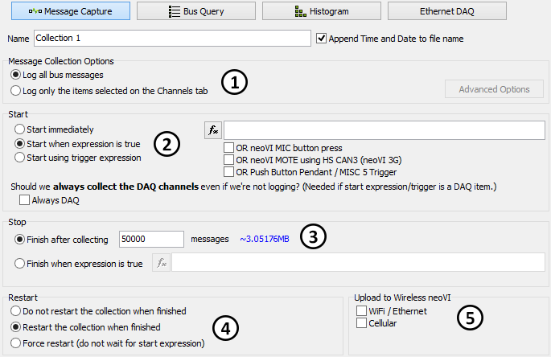

# Collections and Methods: Message Capture Method

In VehicleScape DAQ, the [Standalone Logging](./../../../vehiclescape-daq-standalone-logging-tab/) of a Message Capture [collection](./../../standalone-logging-collections-and-methods/) lets ICS hardware log data files over a period of time. Figure 1 shows the default settings you will see when first entering this area, though changes to some settings will alter the displayed options in other areas.

<figure>

<figcaption>Figure 1: Option subsections for the VehicleScape DAQ Standalone Logging Message Capture collection method.</figcaption>
</figure>

The options for this collection method are broken into five subsections:

* [Message Collection Options:](./message-capture-method-message-collection-options/) Select which messages to log, and how to log them (Figure 1: ).
* [Start Options:](./message-capture-method-start-options/) Specify when to start logging and set options to control how it is done (Figure 1: ).
* [Stop Options:](./../message-capture-method-stop-options/) Tailor the collection process, based in part on the Collection Start Option selected above (Figure 1: ).
* [Restart Options:](./../message-capture-method-restart-options/) Specify whether or not to restart when logging stops (Figure 1: ).
* [Upload to Wireless neoVI:](./../message-capture-method-upload-to-wireless-neovi/) Settings for data upload when using ICS hardware with wireless support (Figure 1: ).

The [Status Reporting](./../../standalone-logging-status-reporting/), [Power Management](./../../standalone-logging-power-management/) and [Generation Options](./../../standalone-logging-generation-options/) sections in the bottom half of the Standalone Logging Tab apply to all method types, including the Message Capture, [Bus Query](./../collections-and-methods-bus-query-method/), [Histogram](./../collections-and-methods-histogram-method/) and [Ethernet DAQ](./../collections-and-methods-ethernet-daq-method/). 