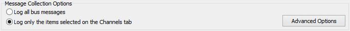
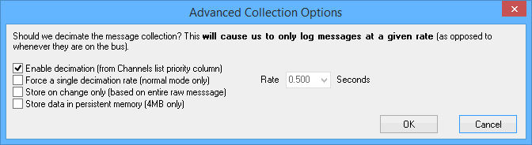

# Message Capture Method: Message Collection Options

In VehicleScape DAQ [Standalone Logging](./../../../../vehiclescape-daq-standalone-logging-tab/), the first set of options for the [Message Capture Method](./../../collections-and-methods-message-capture-method/) deals with which messages to collect. Figure 1 shows this subsection of the options tab.

<figure>

<figcaption>Figure 1: Message Collection Options for the VehicleScape DAQ Standalone Logging Message Capture collection method.</figcaption>
</figure>

There are two main options:

* **Log all bus messages:** Log all messages from all networks.
* **Log only the items selected on the Channels tab:** Log only data selected on the Channels tab.

## Advanced Collection Options

Clicking the **Log only the items selected on the Channels tab** option enables the **Advanced Options** button, which when clicked, opens up a dialog box with more specific settings, as shown in Figure 2.

<figure>

<figcaption>Figure 2: Advanced Message Collection Options when collecting from selected channels.</figcaption>
</figure>

