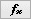

# Message Capture Method: Start Options

In VehicleScape DAQ [Standalone Logging](./../../../../vehiclescape-daq-standalone-logging-tab/), the second set of options for the [Message Capture](./../../collections-and-methods-message-capture-method/) method allows you to choose start options for the collection. There are three main options here, and which selection is made alters other options both in this area and the [Stop](./../../message-capture-method-stop-options/) section.

Table 1 contains a summary of the three start options and information about how each affects other Standalone Logging settings. Subsections following the table describe each of the three options, as well as the **Always DAQ** option.

**Table 1: Collection Start Options for the Messages Method**

| **Start Option**                   | **Description**                                            | **Impact on Collection Start Settings**                                                                                                                                                                                                                                                                                             | **Enabled Collection Configuration Settings**                                                                                                                                                                                                                                                                                                                     |
|------------------------------------|------------------------------------------------------------|-------------------------------------------------------------------------------------------------------------------------------------------------------------------------------------------------------------------------------------------------------------------------------------------------------------------------------------|-------------------------------------------------------------------------------------------------------------------------------------------------------------------------------------------------------------------------------------------------------------------------------------------------------------------------------------------------------------------|
| **Start immediately**              | Start logging data immediately after power up.             | Most other settings are disabled.                                                                                                                                                                                                                                                                                                   | [Finish after collecting # messages](../../message-capture-method-stop-options/message-capture-method-stop-options-finish-after-collecting-messages-or-when-expression-is-true/) or [Finish when expression is true](../../message-capture-method-stop-options/message-capture-method-stop-options-finish-after-collecting-messages-or-when-expression-is-true/). |
| **Start when expression is true**  | Start logging data after the specified expression is true. | Enables the  button so an expression can be entered using the Expression Editor, as well as extra boxes to enable alternative triggering methods.                                                                                                             | [Finish after collecting # messages](../../message-capture-method-stop-options/message-capture-method-stop-options-finish-after-collecting-messages-or-when-expression-is-true/) or [Finish when expression is true](../../message-capture-method-stop-options/message-capture-method-stop-options-finish-after-collecting-messages-or-when-expression-is-true/). |
| **Start using trigger expression** | Start logging data after an expression action.             | Enables the  button so an expression can be entered using the Expression Editor, as well as extra boxes to enable alternative triggering methods.      Also enables extra settings to specify the trigger condition (see below for details).          | [Pre/Post Collection](../../message-capture-method-stop-options/message-capture-method-stop-options-pre-post-collection/) or [One-shot Report](../../message-capture-method-stop-options/message-capture-method-stop-options-one-shot-report/)                                                                                                                    |

## Start Immediately

Data begins logging as soon as the device powers up. The Start Options subsection appears as shown in Figure 1.

Figure 1: Start section options with Start immediately Selected.

## Start When Expression is True

Selecting this option allows you to enter an expression that must be true for collection to start. The Start Options subsection will appear as shown in Figure 2.

Figure 2: Start section options with Start when expression is true Selected.

Press the  button to select an expression that must be true to start collection. You can also check boxes to enable collection to begin on the following events:

* neoVI MIC button press
* neoVI MOTE using HS CAN3
* Push Button Pendant / MISC 5 Trigger

## Start Using Trigger Expression

This option provides extra options for how to trigger data collection based on an expression. Enabling it will cause additional settings to be displayed, as shown in Figure 3.

**Note:** The **Start using trigger expression** option is also used by the [Bus Query](../../collections-and-methods-bus-query-method/) method.

Figure 3: Start section options with Start using trigger expression Selected.

## Selecting a Trigger

The  button is enabled, along with the additional optional trigger options mentioned above:

* neoVI MIC button press
* neoVI MOTE using HS CAN3
* Push Button Pendant / MISC 5 Trigger

## Determining a Trigger Event

There are also three options for determining how to use the selected expression:

* **Trigger when expression is true:** Start logging data when the expression is true, optionally for a set period of time.
* **Trigger when expression changes:** Start logging when the expression changes from its current value.
* **Trigger when expression increases / decreases / changes / exceeds constant and then decreases:** Start logging when the selected event occurs.

# Always DAQ Option

When enabled, always request DAQ items even if they are not being logged. Requested DAQ items are diagnostic signals that get polled from ECUs like DTCs, PIDs, ISO 14229 IDs, and MEP A2L file data items.

This must be enabled if the Start expression uses any requested DAQ item. It is enabled automatically for the **Start immediately** and **Start using trigger expression** collection options.

