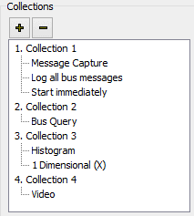

# Standalone Logging: Collections and Methods

A [Standalone Logging](../../vehiclescape-daq-standalone-logging-tab/) collection defines what log files are created by a VehicleScape DAQ setup, and how and when they are recorded. Each collection can use a different method, with its own start/stop trigger logic and configuration settings. Each collection can log many files, and all of the files from that collection will be created in the same manner.

## Working with Collections

A full set of independent parameters and options is maintained for each collection within a Standalone Logging setup. To add a new collection, use the + button located in the upper left corner of the Standalone Logging Tab (Figure 1); to remove a collection, use the - button. Each collection is summarized in the collection list (Figure 1) with a brief summary of its key parameters. To select a collection to work with, simply click on it in the list.

Each Standalone Logging script can have a maximum of 16 collections.

<figure>

<figcaption>Figure 1: Summary information for four different collectins in a Standalone Logging setup; click any entry to view or edit its settings.</figcaption>
</figure>

## Collection Names

The name of a collection can be changed using the text entry box at the top of the setup screen (Figure 2). Modifying the name here will update the name of the collection in the vertical tab set as well.

Every data file saved by the logger script will have the same root name as the collection it came from. Select Append Time and Data to file name to have Vehicle Spy automatically timestamp the files.

<figure>

<figcaption>Figure 2: Defining the name of a collection.</figcaption>
</figure>

### Collection Methods

Each collection uses one of three methods:

* [Message Capture](./collections-and-methods-message-capture-method/): Message data is collected over a period of time.
* [Bus Query](./collections-and-methods-bus-query-method/): A snapshot of data is taken at one point in time.
* [Histogram](./collections-and-methods-histogram-method/): The frequency of data points across a value range is measured over a period of time.
* [Ethernet DAQ](./collections-and-methods-ethernet-daq-method.md): Data is collected over the Ethernet DAQ connection of a properly-configured Intrepid neoVI ION.

The method for a collection is selected using a set of four buttons located at the top of the Standalone Logging Tab (Figure 3). Clicking one of these buttons will change the options in the top right half of the Standalone Logging Tab to suit the requirements of the selected collection type. Details on these settings can be found by clicking a method in the list above to go to its detail page.

Note again that the [Status Reporting](./../standalone-logging-status-reporting/), [Power Management](./../standalone-logging-power-management/) and [Generation Options](./../standalone-logging-generation-options/) sections in the bottom half of the Standalone Logging Tab remain the same for all collection types.

<figure>

<figcaption>Figure 3: There are four collection method options, each with a button that customizes the settings in the upper half of the Standalone Logging tab.</figcaption>
</figure>

