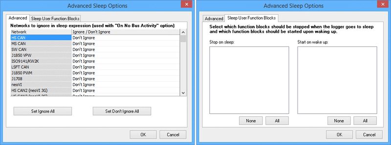

# Standalone Logging: Power Management

Standalone Logging's Power Management features control when the logger goes to sleep to conserve power, and when it wakes up again. These are universal settings that apply to all collections using any of the four collection methods: [Message Capture](./../standalone-logging-collections-and-methods/), [Histogram](../standalone-logging-collections-and-methods/collections-and-methods-histogram-method/), [Bus Query](../standalone-logging-collections-and-methods/collections-and-methods-bus-query-method/) or [Ethernet DAQ](../standalone-logging-collections-and-methods/collections-and-methods-ethernet-daq-method/).

**Note:** ICS loggers, such as the neoVI FIRE, PLASMA and ION, are designed to be always on (they do not have power on/off switches). Sleep and wake settings are provided to minimize power consumption while logging is taking place. It is **CRITICAL** to set these configuration parameters correctly to avoid draining the battery of the car to which a logger is connected!

The Power Management section of the Standalone Logging screen can be found in Figure 1. There are three subsections containing related options, plus an additional option at the bottom of the box, all of which are explained below.

<figure>

<figcaption>Figure 1: Standalone Logging Power Management Options.</figcaption>
</figure>

## Sleep Options

Choose one of the two options to determine whether or not the logger enters sleep mode:

* **Never go to sleep:** Use the default firmware settings configured in the hardware using neoVI 3G Explorer.
* **Sleep when there's no bus activity for # sec:** Enter sleep mode when all selected networks for this logging task are quiet for the specified time period. Networks are chosen in the [Generation Options](../standalone-logging-generation-options/) section.

As mentioned above, ICS hardware by default has sleep mode disabled. If you choose **Never**, the device will never enter sleep mode. Choosing this option can drain the car's battery if used incorrectly.

## Advanced Options

Clicking the **Advanced** button launches a dialog box that gives you even more control over the logger's behavior when it goes to sleep or wakes up. There are two tabs here with options to choose from (both are shown in Figure 2):

* **Advanced (Networks to Ignore):** Select which networks, if any, to be ignored in the expression that is generated to put the logger to sleep.
* **Sleep User Function Blocks:** Specify function blocks to stop running when the logger enters sleep mode, and to begin running when the device wakes up.

**Note:** These settings are also found under **Advanced Options** in the [Generation Options](../standalone-logging-generation-options/) area.

<figure>

<figcaption>Figure 2: Standalone Logging Power Management Advanced Options. Left, the Advanced tab, right, the Sleep User Function Blocks tab.</figcaption>
</figure>

## Wake Options

This setting controls how "deeply" the logger sleeps and how quickly it wakes up. The choice here represents a trade-off between power consumption and responsiveness to the resumption of bus activity; the options and their impacts are explained in Table 1.

In both modes, any activity on any network connected to the logger will trigger a wakeup and keep the logger awake until sleep conditions are met again.

**Table 1: Wake Up Options for Standalone Logging Sleep Mode**

| **Wake Up Mode** | **Sleep Behavior** | **Wake Up Behavior**                                                                      | **Relative Power Consumption** | **Typical Current Draw at 12V** |
|------------------|--------------------|-------------------------------------------------------------------------------------------|--------------------------------|---------------------------------|
| Normal           | Everything runs    | Might not log the first few messages upon wakeup                                          | Lowest while asleep            | PLASMA: ~5 mA FIRE: ~5 mA       |
| Instant (HS/MS)  | Everything runs    | Wakeup triggered from HS or MS CAN allows the message that caused the wakeup to be logged | Higher than Normal mode        | PLASMA: ~27 mA FIRE: ~50 mA     |

## Enable Remote Wake Up (Wireless Devices Only)

This option allows a sleeping neoVI PLASMA to be woken remotely by an SMS text message.

## Start a New File When Waking Up

Enable this option to start a new log file each time the logger wakes up, rather than appending to the previous log

## Wireless neoVI

These settings limit attempts to upload logs wirelessly to Wireless neoVI in order to prevent excessive power use that might drain the car's battery:

* **Overall Timeout:** The maximum amount of time (in minutes) to try a wireless upload.
* **Connection Timeout:** How long to attempt to make a connection before giving up.
* **Voltage Cutoff:** The lowest voltage at which the logger will attempt to upload data.

Exceeding any of these limits will force the logger into sleep mode.

## Disable all VehicleScape Transmissions on Expression