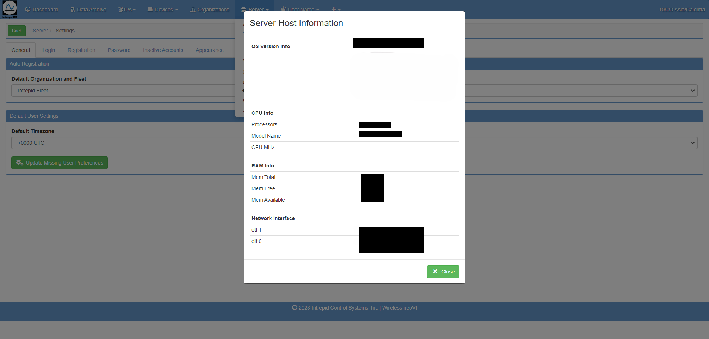
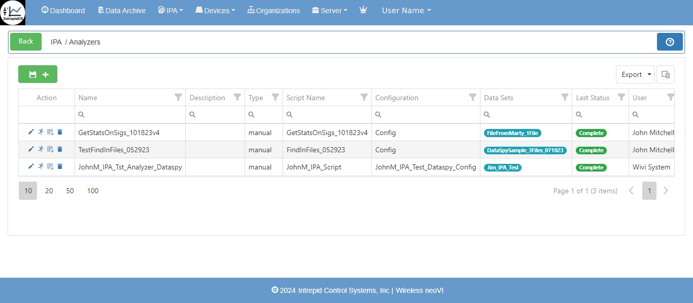
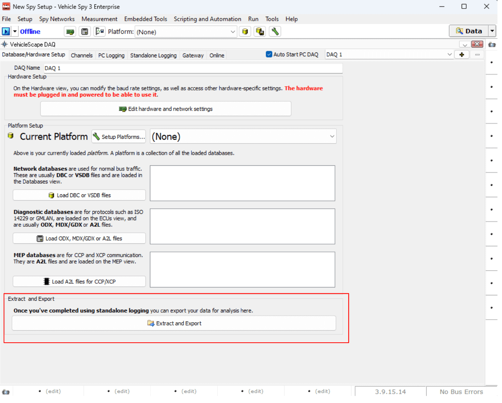

# Wireless neoVI

To begin understanding remote data logging with the Wireless neoVI server and a neoVI hardware connected, the first step is to configure the device and register on our Wireless neoVI server website.

First, connect a PC to the neoVI hardware through 'ETH 02':

<figure>

<figcaption>neoVI FIRE 3 hardware</figcaption>
</figure>

1. Configure the firmware, RTC time, and network baud rate with neoVI Explorer.

Next, on the neoVI hardware itself:

2. Verify the antennas, SIM card, and SDCard \#1 are installed.  
3. Connect the neoVI hardware to DC power and vehicle data bus networks.  
4. Verify the LEDs shows a successful start up of wireless.

Finally, on a PC by itself:

5. Use Vehicle Spy to generate a VS3ZIP script file with desired power management.  
6. Use the Wireless neoVI website Vehicle List to verify the neoVI device is online.  
7. Use the website to send the VS3ZIP script from the PC to the neoVI device.  
8. Use the WiVI website to control, monitor, and transfer data collected by the neoVI device to the PC.

neoVI Explorer configures essential parameters in neoVI hardware to ensure that it works correctly during any mode of operation. Parameters Include its firmware, real time clock(RTC), and vehicle network baud rates, among others. neoVI Explorer MUST run on a PC connected to the neoVI device via the 'ETH 02' port.

<figure>

<figcaption></figcaption>
</figure>

After Explorer is open, your neoVI hardware will show up in the tree on the left.

Clicking the **Connect** button will connect to the device and read its current settings which will be displayed in the area on the right. The status window will indicate any issues while connected to the hardware. 

The firmware versions are displayed on the right and appear as black text if up-to-date and red text if out of date. If needed, the **Manual Reflash** button will update the firmware.

**RTC Time**  
Click **Read RTC** to see the current time of the Real Time Clock. Click **Synchronize RTC** to re-sync the RTC time to the current PC clock time.  

<figure>

<figcaption></figcaption>
</figure>

## Network Settings

To adjust a network setting, like baud rate, click on the proper network in the tree and the area on the right will refresh to show the related settings that can be adjusted. Make sure to click the **Write Settings** button after making changes to push those new settings into the neoVI Connect/RED2/FIRE3. If you make a mistake while changing settings you can click the Load Defaults button to reset ALL Explorer settings in neoVI Explorer back to their defaults.

Using the Wireless neoVI website, devices can be monitored and controlled remotely by a PC. 

## 3.1 Wireless neoVI (WiVI) website {#wireless-neovi-(wivi)-website}

The Wireless neoVI website lets you find, monitor, and control all of your neoVI running in wireless mode from vehicles across the globe. The website server archives log files captured from the vehicles and these files can be downloaded to your PC for further analysis at any time.

This section will show some important settings in the WiVI site

**Log In to Wireless neoVI**  
> Go to ([wirelessneovi.com/](https://preview.wirelessneovi.com/))

Please contact your Wireless neoVI administrator for your website address and account information to get started. After entering your information, click Log In to access your account.  

<figure>

<figcaption>Figure: Log In to the Wireless neoVI website.</figcaption>
</figure>

Should you ever forget your password, click the "Forgot Password?" link below the Login button. Answer your security question correctly and you will be allowed to reset your password.

Upon successful login, users will be directed to the homepage, where they can conveniently access sections for managing fleets, vehicles, and loggers. Logger activity is displayed beneath server information and recent downloads, facilitating easy monitoring. Distinct user and administrator roles provide varying levels of access to the platform, with configuration options available in the settings section for customization.

Wireless neoVI website users have access to the menu selections shown in Figure 2\. Administrator accounts have additional managed menu selections.

<figure>

<figcaption>Figure: Home Page</figcaption>
</figure>

### 3.1.1 User Information {#user-information}

1) User Dashboard  

<figure>

<figcaption>User Dashboard</figcaption>
</figure>

After clicking on user name →  My Account ↴ shows following information.

2) User Account Information including permission details.

<figure>

<figcaption>User Account Information</figcaption>
</figure>

3) Notifications  
   In this window you will check activity related notifications from wireless neoVI.  

<figure>

<figcaption>User Notification Screen</figcaption>
</figure>

4) Download

	The download related files and other things will show here.

### 3.1.2 Server Information {#server-information}

Users have the ability to view server-related information and manage server settings effortlessly. Additionally, users can download server information with a single click.

1) Overview Menu \- Upon selecting the server, within its menu, you will find "Overview" as a submenu. Here, you can access server overview information, including details such as job queue status, disk storage utilization, and component versions.

<figure>

<figcaption>Overview Menu</figcaption>
</figure>

2) Announcement Menu \- Within this submenu, you can view all announcements posted by users, along with their respective dates. You have the option to edit or delete these announcements. Additionally, you can send messages to all site users simply by typing your message.

<figure>

<figcaption>Announcement Menu</figcaption>
</figure>

3) Audit Logs Menu \- Within this menu, all audit log information is displayed. You can filter the logs by Date Range, User, Entity, and Operation to refine the displayed information. Below is an image showing an overview of the audit logs.

<figure>

<figcaption>Audit Logs Menu</figcaption>
</figure>

4) Data Management → Trending \- Within this submenu, you can view all fleets along with their respective vehicles.

<figure>

<figcaption>All fleets along with their respective vehicles</figcaption>
</figure>

5) Data Management → Usage  

<figure>

<figcaption>Data Management Usage Menu</figcaption>
</figure>

6) Logs \- Within this submenu, you can access all log messages, including API, server, dataspy, distiller, UI, and others.  

<figure>

<figcaption>Logs</figcaption>
</figure>

7) Server Host Information \-   

<figure>

<figcaption>Server Host Information</figcaption>
</figure>

### 3.1.3 Organizations Menu {#organizations-menu}

Upon selecting this menu, you will be presented with a list of organizations and their associated users. This includes details such as the number of fleets, groups, and individual users within each organization.

<figure>

<figcaption>Organizations Menu</figcaption>
</figure>

Upon selecting this menu, you will be presented with a list of organizations and their associated users, along with options to add new organizations by clicking on the  button.

**Help** - When you click on the  Help button, it shows the following description with their respective action.

<figure>

<figcaption></figcaption>
</figure>

**Users** - This helps to add new user in the organization. 

<figure>

<figcaption></figcaption>
</figure>

We can see the Added users, in users dashboard section. (actions, first name, last name, user name, email, last active and disable date etc.)

**Grid button** - In this  button, we can enable or disable column grid layout options. Also able to export the data in `.csv` format.

### 3.1.4 Devices Menu {#devices-menu}

When you click on this menu, it shows the following types of submenus.

1) ** Overview** \- This section provides an overview of devices, displaying Actions (Info, Edit, Assign Device, Delete Device), License status, Type, Serial Number, Vehicle association, Script, and SMS information. Users can view columns individually, sorting them in ascending or descending order. Additionally, columns can be hidden as needed. A search function allows users to find specific device types, serial numbers, vehicles, scripts, and SMS details. Data can be exported in CSV format by clicking the grid button for further analysis.

2) ** Component Versions** \-Component Versions \- This section provides comprehensive information on device component versions, including device name, Android version, APK file version, MPIC version, SIM status (presence and IMEI if available), Vspy Compiler version (Vspy software), and last update details. The grid options allow users to enable specific details such as Core FPGA, Coremini, Coremini Size, HID, ICB, HW Rev, LPIC, Modern IMEI, FCHIP, MCHIP, ZCHIP, MPIC Bl, SIM ICCID, Access Point MAC, WiFi MAC, and more as required. Users can export all data in CSV format by clicking the grid button for further analysis and reporting.  
     
     
3) ** Send to Device** \- This feature enables users to upload files to the WiVI server. Users can upload files with valid extensions such as `.wivi`, `.kitt`, `.apk`, `.wnc`, and `.iup`. During the upload process, users can provide a description for the uploaded file. 

<figure>

<figcaption></figcaption>
</figure>

4) ** Update History** \- Upon selection, this section displays the history of uploads, including script file names, descriptions, number of associated devices, user names, and other relevant details. Users can export all data in CSV format by clicking the grid button for further analysis and reporting.  

### 3.1.5 IPA (Integrated Post Analysis) Menu {#ipa-(integrated-post-analysis)-menu}

The IPA (Integrated Post Analysis) service, integrated within Wireless neoVI, facilitates the execution of Python scripts on both static datasets from the data archive and dynamically on live data for analysis purposes. This document aims to dissect the IPA components, outlining the intended usage of each component and the service as a whole.

The IPA menu includes several submenus:

   1. Results: Displays the outcomes and outputs generated from executed Python scripts.  
   2. Analyzers: Provides tools and functionalities to create, manage, and execute Python analyzers for specific data analysis tasks.  
   3. Scripts: Allows users to upload, manage, and execute Python scripts for customized data processing and analysis.  
   4. Data Sets: Provides access to static datasets stored in the data archive for analysis using Python scripts.  
   5. Run Queue: Shows the queue of Python scripts scheduled or currently running, providing status and progress updates.  
   6. How it Works: Offers an explanation and overview of the IPA service, detailing its functionality, capabilities, and integration within the Wireless neoVI platform.

> 1) **Results** \- This shows the IPA results with search and filter option like date range. Also user can export the data in .csv and `.xlsx` format.  

<figure>

<figcaption></figcaption>
</figure>

> 2) **Analyzers** \- Analyzers are central to IPA and encompass several key components. They are designed for easy creation and editing by the user who initiates them. To create an analyzer, navigate to IPA \> Analyzer in the navigation bar and click the "Generate" button. This action prompts you to specify the components required for an Analyzer. 

An Analyzer must include:

* Name: A descriptive title for the analyzer.  
* Run Type: Either "Dynamic" or "Static", indicating whether the analysis is performed on live data as it's uploaded ("Dynamic") or on pre-existing datasets ("Static").  
* Analysis Script: The Python script that defines the analysis to be performed.  
* Dataset: The dataset(s) on which the analysis script will operate.  
* Configurations: Optional settings that customize the behavior of the analysis.  
* Users: Optionally, users with whom results should be automatically shared upon completion.

An analyzer can incorporate multiple analysis scripts, datasets, configurations, and users.

Once created, analyzers are listed on the Analyzer page grid. To run a static analyzer, simply click the run icon next to its entry on the grid. This action initiates a new run in the RunQueue, marked with a status of "New". The IPA Scanner picks up this task, launching a container with all necessary information. The selected analysis script runs on the chosen dataset(s), and results are subsequently displayed on the Results page.

If any issues arise during processing, such as container or script errors, a DockerLog.txt file appears in the results section, containing the error details.

For dynamic datasets, activate them by clicking the green "active" check mark on the grid. This designation ensures that new uploads are automatically evaluated against dataset criteria. Matches trigger the designated analysis process accordingly.

You can create new Analyzers by using the  button. The Analyzer page provides an overview of all analyzers, displaying details such as the Action (options to edit or delete), Name (descriptive title), Description (brief overview), Type (Dynamic or Static), Script Name (Python script used), Configuration (custom settings), Data Sets (associated datasets), Last Status (current run status), and User (creator). 

Users can search for specific analyzers and apply filters as needed. The last status updates automatically based on the completion status of the most recent run.

<figure>

<figcaption></figcaption>
</figure>

<figure>

<figcaption></figcaption>
</figure>

> 3) **Scripts** \- Analysis Scripts are the data processor assigned to an Analyzer. Users can see all Analyzer Scripts available to their organization. All users can upload Analyzer Scripts but it cannot be used by anyone until reviewed and approved by an administrator. AnalyzerScripts can be deleted by their owner and administrators. Scripts may be written in Python (R support may be added in the future). This will allow the user to add specified script to use on server. 

<figure>

<figcaption></figcaption>
</figure>

Also the uploaded script can be reconfigure again or delete. User can export the data in `.csv` and `.xlsx` format. 

<figure>

<figcaption></figcaption>
</figure>

After clicking on the configuration button  it shows following.

<figure>

<figcaption></figcaption>
</figure>

Here User can download the script file, delete file and also be able to view the data in that file in json format. Inside this user can upload a new configuration file.

<figure>

<figcaption></figcaption>
</figure>

**Configurations**:

Configurations are optional for Analyzers but can be used to configure the operation of an Analysis Script based on parameters contained within.

It could be as simple as passing a parameter to make a different method in the script run or as complex as to dictate what to search for in the data.

> 4) **Data Sets** \-  Data Sets define the source data passed to your Analyzer. Data Sets can be generated either by selecting criteria, or by selecting specific files from the data query.

**Files**

Simply navigate to Generate page, perform a search, select your desired files and click "Create DataSet".  
This will generate a Static Data Set which can be used for on demand Analysis.

**Criteria**

A dynamic Data Set is a collection of criteria in any combination or number of:

* Fleets and/or Vehicles  
* Collections and/or file names  
* File extensions  
* Dates  
* Scripts

These Data Sets must be either Static, which are used for on demand analysis on existing files, or Dynamic, which are used for ongoing analysis of files as they are collected.

You may assign multiple Data Sets to an Analyzer so there is no need to create or maintain a single all-inclusive Data Set.

Data Sets created by you are only available to you so may add, edit, or discard them at any time.

<figure>

<figcaption></figcaption>
</figure>

After clicking on  Add button; the search criteria will showing and in this user can select Fleets/Vehicles using check boxes, also selecting Start Date/Time and End Date/Time. User can export the data as well.

<figure>

<figcaption></figcaption>
</figure>

There are two types of datasets, static and dynamic, that can be used with IPA.

A Static Dataset consists of the specific files the dataset creator has chosen or via specific criteria. These datasets can be created in the data archive by selecting the files and choosing “Create Data Set”; they can also be created via the generate page. To do so, select the expected criteria, and make sure the selected type is “Static”.

Analyzing the files in a Static Dataset is a one time process done by simply selecting the Dataset for an Analyzer and clicking the “Run” icon on the Analyzers page.

A Dynamic Dataset consists of search criteria to match files against, instead of specific files. For example, when creating a Dynamic Dataset you could simply specify a vehicle, and the dataset would entail every collection associated with that vehicle, as opposed to going and selecting all the files associated with that vehicle yourself. Dynamic Data Sets at the moment can only match against future uploads.The analysis will be run on incoming collections as long as the Dataset is active. Activating the in a Dynamic Dataset is done by simply selecting the Dataset for an Analyzer and clicking the “Active” icon on the Analyzers.

> 5) **Run Queue**  \- The Run Queue is used for observing and managing existing and previous “Runs”, AKA a time when an Analyzer has tried to apply an Analysis Script(s) to Dataset(s). 

Runs can be canceled by selecting the check mark associated with the row and then selecting Actions \> Cancel Selected. This will kill the container that is being run and end the analysis where it was taking place. Canceling will only work if the Run has a status of “NEW” or “STARTED”.

Runs can be deleted from the queue by selecting the check mark associated with the row and then selecting Actions \> Delete Selected. These runs will not be deleted if the status is not “NEW” or “STARTED”, you must cancel them first. 

It shows the available analyzers, Job name, Result Id, Status, Created At, Started, Finished, User name and Exit Payload etc. The user is then able to export the available data in `.csv format` and `.xlsx format`.  

<figure>

<figcaption></figcaption>
</figure>

### 3.1.6 Data Archive {#data-archive}

<figure>

<figcaption></figcaption>
</figure>

This menu shows the selected Fleets/Vehicles data. Users can select the fleets with Date Range (Start Date and End Date with Start Time and End TIme). Users can sort according to File Types. 

After selecting the options all data shows like Start Date, End Date, Vehicle, Name, Upload Id, View and Data Type etc. 

### 3.1.7 Dashboard Menu {#dashboard-menu}

<figure>

<figcaption></figcaption>
</figure>

In this dashboard menu users can check all the fleets and vehicles that are available in the server as per organization. Also able to check how much server load, recent downloads and logger activity. User can add new fleets and new vehicles through this on clicking   and 

When you click on any available vehicle or fleet, it shows the live status of that vehicle where it is located using google maps. Also it shows the exact speed of the vehicle and device connected to the vehicle with the last connected date and time. And the longitude and latitude on google maps. Users can switch it to satellite view as well as map view.

Users are able to see which device is assigned to that vehicle/fleet. Also show the status of the device whether it is connected or disconnected. Below that is the external IP address and Local IP address there. User can download the script file by clicking on script file which is .vs3zip extension if you want to send script file to that device user just needs to click  icon.

After that a pop up window open and shows **VehicleSpy version, Uploaded date and time, Description of the file, Size, CoreMini 16-bit and CoreMini 32-bit, Files history till current date and in last on which Vehicle has file is send, connected Device name and when it Scheduled, also shows Progress of that. Below is the example for the same.**  

<figure>

<figcaption></figcaption>
</figure>

In the below when you click on Data. The data section shows the Data Archive, Pending Uploads, Manual Uploads From Device, Upload Data From PC, Export Settings etc.

**Data Archive \-** When you click on this menu, it redirects to the Data Archive menu. In this we can see the selected Fleets/Vehicles data. Users can select the fleets with Date Range (Start Date and End Date with Start Time and End TIme). Users can sort according to File Types. 

After selecting the options all data shows like Start Date, End Date, Vehicle, Name, Upload Id, View and Data Type etc. 

**Pending Uploads \-**  When you click on pending uploads, it shows the pending uploads of files.

<figure>

<figcaption></figcaption>
</figure>

## 3.2 Creating a Script in Vehicle Spy 3 {#creating-a-script-in-vehicle-spy-3}

To utilize wireless mode and Wireless neoVI, a VS3ZIP script file must be generated in Vehicle Spy 3’s VehicleScape DAQ. The script file tells the device how to operate on its own while connected to a vehicle. The Wireless neoVI website can then send the VS3ZIP script from your PC to the neoVI Connect/RED2/FIRE3 hardware.

### 3.2.1 Utilizing VehicleScape DAQ {#utilizing-vehiclescape-daq}

This section will show you how to make a VS3ZIP file in Vehicle Spy 3 utilizing VehicleScape DAQ.

1\. Open Vehicle Spy 3 on a PC. (Connection to hardware is not needed)  
2\. Click Measurement and open VehicleScape DAQ. (Figure 1\)  
3\. Setup a platform with databases.  
4\. Select Channels of messages and signals to log.  
5\. Configure Standalone Logging options.  
6\. Generate the VS3ZIP script on your PC.

<figure>

<figcaption>Figure: Opening VehicleScape DAQ</figcaption>
</figure>

<figure>

<figcaption>Figure: Use Vehicle Spy 3 VehicleScape DAQ to make a VS3ZIP script for supported neoVI Connect/RED2/FIRE3 hardware.</figcaption>
</figure>

**VehicleScape DAQ: Database/Hardware Setup Tab (Setup Databases)**

The critical role of the Database/Hardware Setup tab (Figure 1\) is to set up databases for decoding all vehicle network data. You can also use this tab to change the VS3ZIP script file name and set up neoVI Connect/RED2/FIRE3 hardware.

**Setup Databases**

The Platform Setup section has four parts. All database choices made here will affect the list of signals available on the Channels tab nearby.  

<figure>

<figcaption></figcaption>
</figure>

The first section is the Current Platform.   
The platform consists of the entire group of databases in the next three sections. VehicleScape is very database-dependent, so selecting the correct platform is important\! If the platform is not correct or does not exist yet, this section will let you correct it. To change the platforms in the list, click the Setup Platforms button to edit them.

The following section covers Network databases, which are utilized for all regular vehicle network traffic (non-diagnostic). To access the Network Databases dialog, click the Load DBC or VSDB files button.

**1\. Network databases**

* These databases are applied to all normal mode (non-diagnostic) vehicle network traffic.   
* Clicking the Load DBC or VSDB files button will bring up the Network Databases dialog.

**2\. Diagnostic databases**

* These databases are applied to all diagnostic vehicle network traffic.   
* Clicking the Load ODX, MDX/GDX, or A2L files button will take you to ECUs view where new diagnostic database files can be loaded.

**3\. MEP databases**

* Memory Edit Protocol reads and writes ECU memory locations using A2L database files applied to CCP or XCP vehicle network traffic.   
* If any are missing or need updating, the Load A2L files for CCP/XCP will display a MEP view where A2L Files can be added or updated.

**Extract and Export**  

<figure>

<figcaption></figcaption>
</figure>

The "Extract and Export" button opens a feature that can use your PC to read an SD card taken from a neoVI, extract raw data VSB files from it, then export those VSB files to other decoded file types. For neoVI working in wireless mode this extract/export process is usually done with the Wireless NeoVI website without fumbling around with SD cards

**VehicleScape DAQ: Channels Tab (Select Channels to Log)**

This is step 4 in making a VS3ZIP script to operate in Wireless neoVI. The VehicleScape DAQ Channels tab is where signals are selected to log. This tab is split into left and right window panes. The left side displays a list of signals to pick from and the right side allows further adjustments to the signals selected.

**Left Side of Channels Tab (Figure 1\)**

Utilize the left-hand panel of the tab to conduct searches and designate signals from an extensive list. This compilation encompasses messages and signals sourced from databases accessible through the adjacent Database/Hardware Setup tab, as well as data from the Messages Editor and Application Signals.

Users can refine the signal list through two methods: entering text into the search field or accessing the diagnostics button to select a diagnostic category within the network/ECU tree. Additionally, users can create groups of items by employing the press-and-hold function of the CTRL or SHIFT keys while left-clicking on the desired items.

Users have the option to designate highlighted signals for logging individually or collectively. This can be achieved by selecting signals one by one or all at once, facilitated by the respective buttons located below the search field.

The **Paste List** button can speed up signal selection when working with a huge list of signals. First, copy to the clipboard a list of line delimited signal names from any source, like a column in a spreadsheet. Next, click the Paste List button and Vehicle Spy will attempt to select all signals that match the clipboard entries. Specific Problem Logs will indicate any signals that Vehicle Spy could not find a match for

<figure>

<figcaption></figcaption>
</figure>

Use the left side of VehicleScape DAQ Channels to find and select signals to log. Use the right side of the tab to make adjustments to the signals selected.

**Polling Setup**

These polling rates determine how fast any one shot diagnostic jobs are repeated. These polling rates do NOT affect MEP A2L file data items because those items use their own MEP DAQ Delay times.

The **Set Export Order** button sets the ordering of signals in CSV and MAT signal export files.

If GMLAN is enabled in Vehicle Spy Tools/Options, then items from GM cal files can be loaded by clicking a CAL File button.

**Selected Channels For Test**

The Selected Channels for Test area in the lower half of Figure 2 displays the signals that were selected to be logged. If the signal is a PID or MEP A2L file data item then its priority (how often it gets requested) can be changed to Fast/Medium/Slow by double clicking on it. At the bottom of this area, use the Clear button to clear the entire list or the **Remove** button to remove signals one at a time.

<figure>

<figcaption></figcaption>
</figure>

    

**Right Click Menu (Figure 3\)**

The Selected Channels For Test area has an extensive right click menu with selections described below in Table 1\.  

<figure>

<figcaption>Figure: The Selected Channels For Test area has useful right click menu selections.</figcaption>
</figure>

|  **Rt Click Menu Selection** 	|                                                                                                                                                                                                                         **Description**                                                                                                                                                                                                                        	|
|:----------------------------:	|:--------------------------------------------------------------------------------------------------------------------------------------------------------------------------------------------------------------------------------------------------------------------------------------------------------------------------------------------------------------------------------------------------------------------------------------------------------------:	|
| Priority High/Normal/Low     	| Sets the periodic rate of one shot requests sent for this item.  Polling Setup defaults (ms):  **High = 0 / Normal = 150 / Low = 500**  GMLAN DPID = job $AA/01 GMLAN PID = job $22 GMLAN Memory Data = job $23 ISO 14229 DID = job $22 (only if ISO15765 not needed) ISO 14229 Memory Data = job $23  MEP DAQ Delays (ms): **High = 0 / Normal = 150 / Low = 600** MEP A2L item = MEP DAQ Delay rate                	|
| CCP/XCP Events               	| Allowed only for MEP A2L items. Selects an ECU event schedule defined in an A2L file. This is known as event based DAQ'ing.                                                                                                                                                                                                                                                                                                                                 	|
| Periodic Fast/Medium/Slow 	| Sets the periodic DPID schedule rate that this item is packed in. Per GMW3110 specification (ms): **Fast = 25 / Medium = 200 / Slow = 1000**    GMLAN DPID = job $AA 04/03/02    GMLAN PID = job $2C + $AA 04/03/02    GMLAN Memory Data = job $2D + $2C + $AA 04/03/02 Per ISO 14229 specification (ms): **"vehicle-manufacturer-specific"** ISO 14229 DID = job $2C + $2A 03/02/01 ISO 14229 Memory Data = job $2C + $2A 03/02/01 	|
| Change condition             	| Allowed only for ISO 14229 and GMLAN items. Selects which Standalone Logging collections must be active for this signal to be requested.                                                                                                                                                                                                                                                                                                                    	|
| Pack at half precision       	| If an item Priority = Periodic this packs only the signal's top half most significant bytes into a dynamic DPID. This allows packing more items, but with a sacrifice of precision.                                                                                                                                                                                                                                                                            	|
| Copy DID to ECU              	| Copies a DID definition from one "real" ECU to another in the diagnostic database.                                                                                                                                                                                                                                                                                                                                                                             	|
| Move DID to ECU              	| Allowed only for ISO 14229 DIDs with its source being a base/virtual/GMRDB ECU with USDT request ID = 0. Use this to copy DIDs from a base/virtual/GMRDB ECU with DID definitions to "real" ECUs that need DID definitions in the diagnostic database. The base/virtual/GMRDB ECU DID list will remain unchanged after using this menu selection.                                                                                                        	|
| Remove selected              	| Cuts selected signals from the list without copying them to the clipboard.                                                                                                                                                                                                                                                                                                                                                                                     	|
| Cut                          	| Cuts selected signals from the list and copies their information to the clipboard                                                                                                                                                                                                                                                                                                                                                                              	|
| Copy data                    	| Copies all signal information to the clipboard in a tab delimited format that can be pasted into a spreadsheet application.                                                                                                                                                                                                                                                                                                                                    	|
| Paste                        	| Pastes previously cut signals into the list.                                                                                                                                                                                                                                                                                                                                                                                                                   	|
| Show Diagnostic Tweaker      	| Shows a viewing area on the right side of the Online tab.                                                                                                                                                                                                                                                                                                                                                                                                      	|
| Set Export Order             	| Sets the ordering of signals in CSV and MAT signal export files.                                                                                                                                                                                                                                                                                                                                                                                               	|

This is step 5 in making a VS3ZIP script to operate neoVI in wireless mode.

Additional help can be found in the VehicleScape DAQ Standalone Logging application note within the Vehicle Spy help files.

The Standalone Logging tab generates a script that lets ICS hardware collect data on its own while disconnected from a computer.

**Standalone Logging Page Layout (Setup Standalone Logging)**

The Standalone Logging page has 2 major areas and described in Table 1\.

The upper area has Collection setups that change appearance depending upon which method is being used in that collection.

The bottom area contains important sections that do not change appearance because these settings affect ALL collections above.

**Table 1: Standalone Logging Setup Areas**

<table><tbody>
  <tr>
    <td>**Standalone Logging Area**</td>
    <td>**Description**</td>
  </tr>
  <tr>
    <td>Collections and Methods </td>
    <td>Collections define log file creation and they can use different methods to gather data.</td>
  </tr>
  <tr>
    <td colspan="2" class="td-center">**The following settings affect ALL Standalone Logging collections**</td>
  </tr>
  <tr>
    <td>Reporting Options </td>
    <td>Options for physical logger feedback and Live Data reporting to a Wireless NeoVI website.</td>
  </tr>
  <tr>
    <td>Power Management </td>
    <td>Logger sleep and wakeup selections are made here.</td>
  </tr>
  <tr>
    <td>Generate </td>
    <td>Generates the final script and opens a dialog to send it to ICS hardware that supports standalone logging</td>
  </tr>
</tbody>
</table>

<figure>

<figcaption>VehicleScape DAQ Standalone Logging tab overview</figcaption>
</figure>

In Vehicle Spy, the VehicleScape DAQ Standalone Logging tab has 2 major areas. The top half, shown above, contains settings for this current collection selected. The bottom half, shown below, contains settings for all collectons. Click ‘Generate’ at the very bottom to compile CoreMini and create your .wivi file. 

<figure>

<figcaption></figcaption>
</figure>

### 3.2.2 Standalone Logging Collections and Methods {#standalone-logging-collections-and-methods}

#### 1 – Collections {#collections}

A Standalone Logging collection defines how, when, and what log files are created. Each collection can use a different method with its own start/stop trigger logic and configuration settings. Each collection can log many files and all of the files from that collection will be created in the same manner.

Collections appear as vertical tabs along the right side of Standalone Logging similar to Figure 1\. They can be added and deleted using the \+/- buttons nearby. One standalone logger script can have a maximum of 16 unique collections.

The collection name can be changed at the top of each method setup area as shown in Figure 2\. Every data file saved by the logger script will have the same root name as the collection it came from.

<figure>

<figcaption>Figure: This collection name is shown on the vertical tabs.</figcaption>
</figure>

<figure>

<figcaption>Figure: Collection tabs</figcaption>
</figure>

                                   

**Methods**

Each collection (Figure 3\) can gather messages, a histogram, or a bus query.

* Messages \- data over a period of time.  
* Histogram \- frequency of data points across a value range over a period of time.  
* Bus Query \- snapshot of data at one point in time.

The following links will take you to detailed help for each Standalone Logging method

<figure>

<figcaption>Figure: Standalone Logging can gather messages, histograms, and bus queries.</figcaption>
</figure>

#### 2 – Message {#message}

In VehicleScape DAQ the Standalone Logging of a Messages collection lets ICS hardware log data files over a period of time. Use the links in Table 1 to see more help for the setup options.

<figure>

<figcaption>Figure: The VehicleScape DAQ Standalone Logging Messages selection.</figcaption>
</figure>

Table 1: Standalone Logging Messages Setup Sections

<table><tbody>
  <tr>
    <td>**Messages Setup Section**</td>
    <td>**Description**</td>
  </tr>
  <tr>
    <td>Message Collection Options</td>
    <td>For this collection, select which messages to log and how to log them.</td>
  </tr>
  <tr>
    <td>Collection Start Options</td>
    <td>For this collection, select when to start logging data.</td>
  </tr>
  <tr>
    <td>Collection Configuration</td>
    <td>For this collection, select when to stop logging data</td>
  </tr>
  <tr>
    <td>Restart Options</td>
    <td>For this collection, select when to restart logging data.</td>
  </tr>
  <tr>
    <td>neoVI Collection Upload</td>
    <td>For this collection, select when to upload data to a WirelessNeoVI server.</td>
  </tr>
  <tr>
    <td colspan="2" class="td-center">**The following settings affect ALL Standalone Logging collections**</td>
  </tr>
  <tr>
    <td>Reporting Options</td>
    <td>Options for physical logger feedback and Live Data reporting to a Wireless NeoVI website</td>
  </tr>
  <tr>
    <td>Power Management</td>
    <td>Logger sleep and wakeup selections are made here.</td>
  </tr>
  <tr>
    <td>Generate</td>
    <td>Generates the final script and opens a dialog to send it to ICS hardware that supports standalone logging</td>
  </tr>
</tbody></table>

<figure>

<figcaption>Figure: The Standalone Logging Message Collection Options.</figcaption>
</figure>

In VehicleScape DAQ the Standalone Logging of a Messages collection has specific settings described in Table 1 and shown in above Figure\.

Table 1: Standalone Logging Message Collection Options

<table><tbody>
  <tr>
    <td>**Message Collection Option**</td>
    <td>**Description**</td>
  </tr>
  <tr>
    <td>Entire Bus</td>
    <td>In this collection, log all messages from all networks.</td>
  </tr>
  <tr>
    <td>Selected Messages</td>
    <td>In this collection, only log data selected on the Channels tab.</td>
  </tr>
  <tr>
    <td>Enable decimation</td>
    <td>In this collection, log selected data at periodic rates defined in the Channels tab Priority column.</td>
  </tr>
  <tr>
    <td>Force a single decimation rate</td>
    <td>In this collection, log selected normal mode data at a chosen periodic rate, regardless of how fast/slow it appears on the network. Diagnostic mode data rates are unaffected.</td>
  </tr>
  <tr>
    <td>Store on change only</td>
    <td>In this collection, log selected data only if any data in its carrier message has changed.</td>
  </tr>
  <tr>
    <td colspan="2" class="td-center">**The following settings affect ALL Standalone Logging collections**</td>
  </tr>
  <tr>
    <td>Reporting Options</td>
    <td>Options for physical logger feedback and Live Data reporting to a Wireless NeoVI website</td>
  </tr>
  <tr>
    <td>Power Management</td>
    <td>Logger sleep and wakeup selections are made here.</td>
  </tr>
  <tr>
    <td>Generate</td>
    <td>Generates the final script and opens a dialog to send it to ICS hardware that supports standalone logging.</td>
  </tr>
</tbody></table>

<figure>

<figcaption>Figure: The Standalone Logging Message Collection Options.</figcaption>
</figure>

In VehicleScape DAQ the Standalone Logging of a Messages or Bus Query collection has Start Options described in Table 1 and shown in above Figure.

Table 1: Standalone Logging Collection Start Options

<table><tbody>
  <tr>
    <td>**Collection Start Option**</td>
    <td>**Description**</td>
  </tr>
  <tr>
    <td>Immediately</td>
    <td>In this collection, start logging data immediately after power up. This enables a Finish After Messages or Expression.</td>
  </tr>
  <tr>
    <td>When Expression is True</td>
    <td>In this collection, start logging data after the expression is true. This enables a Finish After Messages or Expression.</td>
  </tr>
  <tr>
    <td>Using Trigger</td>
    <td>In this collection, start logging data after an expression action. This enables setup of a Pre/Post Collection or One Shot Report</td>
  </tr>
  <tr>
    <td>Trigger when expression is true</td>
    <td>In this collection, start logging data after the expression is true for a selected time.</td>
  </tr>
  <tr>
    <td>Trigger when expression changes</td>
    <td>In this collection, start logging data after the expression changes from its current value.</td>
  </tr>
  <tr>
    <td>Trigger when expression increases/decreases</td>
    <td>In this collection, start logging data after the expression changes from its current value by some chosen amount.</td>
  </tr>
  <tr>
    <td>Manual Trigger</td>
    <td>In this collection, start logging data if the neoVI MOTE or other pendant button is pressed.</td>
  </tr>
  <tr>
    <td>Always DAQ</td>
    <td>In this collection, always request DAQ items even if they are not being logged. Requested DAQ items are diagnostic signals that get polled from ECUs like DTCs, PIDs, ISO 14229 IDs, and MEP A2L file data items. This must be enabled if the Start expression uses any requested DAQ item.</td>
  </tr>
  <tr>
    <td colspan="2" class="td-center">**The following settings affect ALL Standalone Logging collections**</td>
  </tr>
  <tr>
    <td>Reporting Options</td>
    <td>Options for physical logger feedback and Live Data reporting to a Wireless NeoVI website.</td>
  </tr>
  <tr>
    <td>Power Management</td>
    <td>Logger sleep and wakeup selections are made here.</td>
  </tr>
  <tr>
    <td>Generate</td>
    <td>Generates the final script and opens a dialog to send it to ICS hardware that supports standalone logging.</td>
  </tr>
</tbody></table>

<figure>

<figcaption>Figure: The Standalone Logging Collection Start Options.</figcaption>
</figure>

 

In VehicleScape DAQ the Standalone Logging of a Messages or Bus Query collection has a Collection Configuration setup that changes appearance based upon what Collection Start Option is selected. Use the links described in Table 1 to see more help for each configuration setup.

Table 1: Standalone Logging Collection Configurations

<table><tbody>
  <tr>
    <td>**Collection Configuration**</td>
    <td>**Description**</td>
  </tr>
  <tr>
    <td>Finish After Messages or Expression</td>
    <td>For this collection, stop logging after a chosen number of messages are logged or after an expression is true. This setup is enabled if Collection Start Option = Immediately or When Expression is True</td>
  </tr>
  <tr>
    <td>Pre/Post Collection</td>
    <td>For this collection, log data before and after the Collection Start trigger. The capture window can be defined using an expression, a length of time, or a number of messages. This setup is enabled if Collection Start Option = Using Trigger.</td>
  </tr>
  <tr>
    <td>One Shot Report</td>
    <td>For this collection, log a snapshot of data values after a Collection Start triggered chosen delay time. This setup is enabled if Collection Start Option = Using Trigger.</td>
  </tr>
  <tr>
    <td colspan="2" class="td-center">The following settings affect ALL Standalone Logging collections</td>
  </tr>
  <tr>
    <td>Reporting Options</td>
    <td>Options for physical logger feedback and Live Data reporting to a Wireless NeoVI website.</td>
  </tr>
  <tr>
    <td>Power Management</td>
    <td>Logger sleep and wakeup selections are made here.</td>
  </tr>
  <tr>
    <td>Generate</td>
    <td>Generates the final script and opens a dialog to send it to ICS hardware that supports standalone logging</td>
  </tr>
</tbody></table>

In VehicleScape DAQ the Standalone Logging of a Messages collection has a Collection Configuration setup area that changes appearance based upon what Collection Start Option is selected.

The Collection Configuration in Figure 1 is displayed only if:

**Collection Start Option \= Immediately or When Expression is True**

Table 1 describes each setting in Figure 1 and some other settings that affect all collections.

Table 1: Standalone Logging Collection Configuration \- Finish After Messages or Expression Options

<table><tbody>
  <tr>
    <td>**Collection Configuration Setting**</td>
    <td>**Description**</td>
  </tr>
  <tr>
    <td>Finish After # of Messages</td>
    <td>For this collection, stop logging data when a chosen number of messages are logged after the Collection Start trigger.</td>
  </tr>
  <tr>
    <td>Finish on Expression</td>
    <td>For this collection, stop logging after an expression is true.</td>
  </tr>
  <tr>
    <td>Collection / Log File Name</td>
    <td>The name of this collection and the root name of all log files it creates</td>
  </tr>
  <tr>
    <td colspan="2" class="td-center">The following settings affect ALL Standalone Logging collections</td>
  </tr>
  <tr>
    <td>Reporting Options</td>
    <td>Options for physical logger feedback and Live Data reporting to a Wireless NeoVI website.</td>
  </tr>
  <tr>
    <td>Power Management</td>
    <td>Logger sleep and wakeup selections are made here.</td>
  </tr>
  <tr>
    <td>Generate</td>
    <td>Generates the final script and opens a dialog to send it to ICS hardware that supports standalone logging</td>
  </tr>
</tbody></table>

<figure>

<figcaption>Figure: The Collection Configuration if Collection Start \= Immediately or When Expression is True</figcaption>
</figure>

 

In VehicleScape DAQ the Standalone Logging of a Messages collection has a Collection Configuration setup area that changes appearance based upon what Collection Start Option is selected.

The Collection Configuration in above Figure is displayed if:

**Collection Start Option \= Using Trigger and Pre/Post Collection is selected.**

Table 1 describes each setting in Figure 1 and some other settings that affect all collections.

Table 1: Standalone Logging Collection Configuration \- Pre/Post Collection Options

<table><tbody>
  <tr>
    <td>**Pre/Post Collection Setting**</td>
    <td>**Description**</td>
  </tr>
  <tr>
    <td>Pre/Post Collection</td>
    <td>For this collection, log data before and after the Collection Start trigger. The capture window can be defined using an expression, a length of time, or a number of messages.</td>
  </tr>
  <tr>
    <td>One-shot Report</td>
    <td>For this collection, log a snapshot of data values after a Collection Start triggered chosen delay time. Click the link to see further details.</td>
  </tr>
  <tr>
    <td>Stop on expression</td>
    <td>For this collection, stop logging when the expression is true</td>
  </tr>
  <tr>
    <td>"Changing" Checkbox</td>
    <td>For this collection, stop logging when the expression changes from its current value.</td>
  </tr>
  <tr>
    <td>Timeout Sec</td>
    <td>For this collection, stop logging when the expression is true/changes value OR after a timeout period in seconds. This timeout is disabled if set = 0 and logging will stop based only upon the expression logic.</td>
  </tr>
  <tr>
    <td>Card Size</td>
    <td>SD card memory size in the ICS hardware that will run the Standalone Logging script.</td>
  </tr>
  <tr>
    <td>By time</td>
    <td>For this collection, use time to define the pre/post capture window.</td>
  </tr>
  <tr>
    <td>Time Before/After Trigger</td>
    <td>For this collection, save a log file that starts/stops at the chosen times around the Collection Start trigger.</td>
  </tr>
  <tr>
    <td>By number of messages</td>
    <td>For this collection, use message count to define the pre/post capture window.</td>
  </tr>
  <tr>
    <td>Messages Before/After Trigger</td>
    <td>For this collection, save a log file that starts/stops at the chosen message counts around the Collection Start trigger.</td>
  </tr>
  <tr>
    <td>Collection / Log File Name</td>
    <td>The name of this collection and the root name of all log files it creates.</td>
  </tr>
  <tr>
    <td colspan="2" class="td-center">The following settings affect ALL Standalone Logging collections</td>
  </tr>
  <tr>
    <td>Reporting Options</td>
    <td>Options for physical logger feedback and Live Data reporting to a Wireless NeoVI website.</td>
  </tr>
  <tr>
    <td>Power Management</td>
    <td>Logger sleep and wakeup selections are made here.</td>
  </tr>
  <tr>
    <td>Generate</td>
    <td>Generates the final script and opens a dialog to send it to ICS hardware that supports standalone logging</td>
  </tr>
</tbody></table>

<figure>

<figcaption>Figure: The Collection Configuration if Collection Start \= Using Trigger and Pre/Post is selected.</figcaption>
</figure>

 

In VehicleScape DAQ the Standalone Logging of a Messages or Bus Query collection has a Collection Configuration setup area that changes appearance based upon what Collection Start Option is selected.

The Collection Configuration in Figure 1 is displayed if:

**Collection Start Option \= Using Trigger** and One-shot Report is selected.

Table 1 describes each setting in Figure 1 and some other settings that affect all collections.

Table 1: Standalone Logging Collection Configuration \- One Shot Report Setting

<table><tbody>
  <tr>
    <td>**One Shot Report Option**</td>
    <td>**Description**</td>
  </tr>
  <tr>
    <td>Pre/Post Collection</td>
    <td>For this collection, log data before and after the Collection Start trigger. The capture window can be defined using an expression, a length of time, or a number of messages. Click the link to see further details.</td>
  </tr>
  <tr>
    <td>One-shot Report</td>
    <td>For this collection, log a snapshot of data values after the Collection Start trigger then stop logging.</td>
  </tr>
  <tr>
    <td>After trigger delay</td>
    <td>For this collection, wait for a delay time (in seconds) after the Collection Start trigger then log a snapshot of data values and stop logging. If the trigger delay = 0 then the One Shot Report will occur immediately.</td>
  </tr>
  <tr>
    <td>Collection / Log File Name</td>
    <td>The name of this collection and the root name of all log files it creates.</td>
  </tr>
  <tr>
    <td colspan="2" class="td-center">The following settings affect ALL Standalone Logging collections</td>
  </tr>
  <tr>
    <td>Reporting Options</td>
    <td>Options for physical logger feedback and Live Data reporting to a Wireless NeoVI website.</td>
  </tr>
  <tr>
    <td>Power Management</td>
    <td>Logger sleep and wakeup selections are made here.</td>
  </tr>
  <tr>
    <td>Generate</td>
    <td>Generates the final script and opens a dialog to send it to ICS hardware that supports standalone logging</td>
  </tr>
</tbody></table>

<figure>

<figcaption>Figure: The Collection Configuration if Collection Start \= Using Trigger and One Shot Report is selected.</figcaption>
</figure>

 

In VehicleScape DAQ the Standalone Logging of a Messages or Bus Query collection has Restart Options that change appearance based upon other collection settings.

Table 1 describes the settings in Figures 1 to 3 and some other settings that affect all collections.

Table 1: Standalone Logging Restart Options

<table><tbody>
  <tr>
    <td>**Restart Option**</td>
    <td>**Description**</td>
  </tr>
  <tr>
    <td>Stop</td>
    <td>In this collection, stop logging after the stop conditions are met. If using Pre/Post Collection then stop only after the max number of trigger events have been collected. This setting disappears if a Pre/Post Collection is using a stop expression.</td>
  </tr>
  <tr>
    <td>Restart</td>
    <td>In this collection, restart logging after the stop conditions are met and wait again for the Collection Start trigger.</td>
  </tr>
  <tr>
    <td>Force Restart</td>
    <td>In this collection, always restart logging after the stop conditions are met. (ignore the initial Collection Start trigger) This setting is available if Collection Start Option = When Expression is True.</td>
  </tr>
  <tr>
    <td colspan="2" class="td-center">The following settings affect ALL Standalone Logging collections</td>
  </tr>
  <tr>
    <td>Reporting Options</td>
    <td>Options for physical logger feedback and Live Data reporting to a Wireless NeoVI website.</td>
  </tr>
  <tr>
    <td>Power Management</td>
    <td>Logger sleep and wakeup selections are made here.</td>
  </tr>
  <tr>
    <td>Generate</td>
    <td>Generates the final script and opens a dialog to send it to ICS hardware that supports standalone logging.</td>
  </tr>
</tbody></table>

<figure>

<figcaption>Figure: The Restart Options if Collection Start \= Immediately. </figcaption>
</figure>

 

<figure>

<figcaption>Figure: The Restart Options if Collection Start \= When Expression is True.</figcaption>
</figure>

<figure>

<figcaption>Figure: The Restart Options if Collection Configuration \= Stop on Expression.</figcaption>
</figure>

**Standalone Logging neoVI Collection Upload**

In VehicleScape DAQ the Standalone Logging of a Messages or Bus Query collection has neoVI Collection Upload options to take advantage of wireless capabilities.

Table 1 describes the settings in Figure 1 and some other settings that affect all collections.

Table 1: Standalone Logging neoVI Collection Upload Settings

<table><tbody>
  <tr>
    <td>**Wireless neoVI Collection Upload Setting**</td>
    <td>**Description**</td>
  </tr>
  <tr>
    <td>Cellular</td>
    <td>Each time this collection stops, automatically upload its log file to a Wireless neoVI server using the neoVI wireless cellular link. (slower than WIFI, but usually more available in the USA)</td>
  </tr>
  <tr>
    <td>WiFi/Ethernet</td>
    <td>Each time this collection stops, automatically upload its log file to a WirelessNeoVI server using the neoVI WiFi link. (faster than Cellular)</td>
  </tr>
  <tr>
    <td>Fail Timeout</td>
    <td>Each time this collection stops, keep trying to automatically upload its log file to a Wireless neoVI server until successful or until the timeout (in minutes) expires. This timer restarts after each wakeup event.</td>
  </tr>
  <tr>
    <td colspan="2" class="td-center">The following settings affect ALL Standalone Logging collections</td>
  </tr>
  <tr>
    <td>Reporting Options</td>
    <td>Options for physical logger feedback and Live Data reporting to a Wireless NeoVI website.</td>
  </tr>
  <tr>
    <td>Power Management</td>
    <td>Logger sleep and wakeup selections are made here.</td>
  </tr>
  <tr>
    <td>Generate</td>
    <td>Generates the final script and opens a dialog to send it to hardware that supports standalone logging.</td>
  </tr>
</tbody></table>

<figure>

<figcaption>Figure: The Wireless neoVI Collection Upload settings.</figcaption>
</figure>

In VehicleScape DAQ the Standalone Logging of a Histogram collection will log the frequency of data points across a value range over a period of time.

Table 1 describes the settings in Figure 1 and some other settings that affect all collections.

Table 1: Standalone Logging Histogram Settings

<table><tbody>
  <tr>
    <td>**Histogram Setting**</td>
    <td>**Description**</td>
  </tr>
  <tr>
    <td>Collection / Log File Name</td>
    <td>The name of this collection and the root name of all log files it creates.</td>
  </tr>
  <tr>
    <td>Dimensions</td>
    <td>In this collection, log a histogram that uses from 1 to 3 axes.</td>
  </tr>
  <tr>
    <td>**X Y Z Axis Setting**</td>
    <td>**Description**</td>
  </tr>
  <tr>
    <td>Expression</td>
    <td>In this collection, for this axis, count the frequency of values created by this expression. The Expression Builder DAQ data source will list signals selected on the VehicleScape DAQ Channels tab.</td>
  </tr>
  <tr>
    <td>Value is calculated based on "Time" while expression is non-zero (in seconds)</td>
    <td>In this collection, for this axis, count the length of time (in seconds) that the axis expression is non-zero. Use this to count how often an event of varying duration has occurred.</td>
  </tr>
  <tr>
    <td>Min/Max Value</td>
    <td>In this collection, for this axis, set limits on the value range to keep track of.</td>
  </tr>
  <tr>
    <td>Number of Buckets</td>
    <td>In this collection, for this axis, set the number of buckets to apply across the value range.</td>
  </tr>
  <tr>
    <td>Add to closest bucket</td>
    <td>In this collection, for this axis, if the axis expression falls outside the value range then count that value in the closest bucket.</td>
  </tr>
  <tr>
    <td>Create dedicated spillover buckets</td>
    <td>In this collection, for this axis, add spillover buckets at each end of the value range for counting values that fall outside the value range.</td>
  </tr>
  <tr>
    <td> Increment an "invalid" counter</td>
    <td>In this collection, for this axis, increment an "invalid" counter each time the axis expression falls outside the value range.</td>
  </tr>
</tbody></table>

<table><tbody>
  <tr>
    <td>**Histogram Sample Options**</td>
    <td>**Description**</td>
  </tr>
  <tr>
    <td>Every</td>
    <td>In this collection, start logging at a chosen periodic rate in seconds.</td>
  </tr>
  <tr>
    <td>Only when expression is true</td>
    <td>In this collection, start logging data at a chosen periodic rate while the expression is true.</td>
  </tr>
  <tr>
    <td>Using Trigger</td>
    <td>In this collection, start logging data after an expression trigger event.</td>
  </tr>
  <tr>
    <td>Trigger when expression is true</td>
    <td>In this collection, start logging data after the expression is true for a selected time.</td>
  </tr>
  <tr>
    <td>Trigger when expression changes</td>
    <td>In this collection, start logging data after the expression changes from its current value.</td>
  </tr>
  <tr>
    <td>Trigger when expressionincreases/decreases</td>
    <td>In this collection, start logging data after the expression changes from its current value by some chosen amount.</td>
  </tr>
  <tr>
    <td>Manual Trigger</td>
    <td>In this collection, start logging data if the neoVI MOTE or other pendant button is pressed.</td>
  </tr>
  <tr>
    <td>Always DAQ</td>
    <td>In this collection, always request DAQ items even if they are not being logged. Requested DAQ items are diagnostic signals that get polled from ECUs like DTCs, PIDs, ISO 14229 IDs, and MEP A2L file data items. This must be enabled if a start expression uses any requested DAQ item.</td>
  </tr>
  <tr>
    <td colspan="2" class="td-center">The following settings affect ALL Standalone Logging collections</td>
  </tr>
  <tr>
    <td>Reporting Options</td>
    <td>Options for physical logger feedback and Live Data reporting to a Wireless NeoVI website.</td>
  </tr>
  <tr>
    <td>Power Management</td>
    <td>Logger sleep and wakeup selections are made here.</td>
  </tr>
  <tr>
    <td>Generate</td>
    <td>Generates the final script and opens a dialog to send it to ICS hardware that supports standalone logging.</td>
  </tr>
</tbody></table>

<figure>

<figcaption>Figure: The Standalone Logging Histogram settings.</figcaption>
</figure>

**Standalone Logging - Bus Query Method**

In VehicleScape DAQ the Standalone Logging of a Bus Query collection can log a snapshot of DID values and DTCs at one point in time from several ECUs at once.

Table 1 describes the settings in Figure 1 and some other settings that affect all collections.

Table 1: Standalone Logging Bus Query Settings

<table><tbody>
  <tr>
    <td>**Bus Query Setting**</td>
    <td>**Description**</td>
  </tr>
  <tr>
    <td>Base ECU</td>
    <td>In this collection, use the DID definitions in this ECU to apply to the entire Bus Query.</td>
  </tr>
  <tr>
    <td>Select ECUs</td>
    <td>In this collection, log a bus query from these chosen ECUs.</td>
  </tr>
  <tr>
    <td>Specify a Range</td>
    <td>In this collection, log a bus query from all ECUs within a range of arbitration IDs on a chosen network.</td>
  </tr>
  <tr>
    <td>Diagnostic ID of first/last ECU</td>
    <td>In this collection, log a bus query from all ECUs within this range of arbitration IDs.</td>
  </tr>
  <tr>
    <td>Network of ECUs</td>
    <td>In this collection, log a bus query from all ECUs within a range of arbitration IDs on this network.</td>
  </tr>
  <tr>
    <td>Select DIDs</td>
    <td>In this collection, log a bus query of these chosen DIDs.</td>
  </tr>
  <tr>
    <td>Read DTCs</td>
    <td>In this collection, log all DTCs (diagnostic trouble codes) from all chosen ECUs if the DTC passes the Status Mask filter.</td>
  </tr>
  <tr>
    <td>Read Extended/Snapshot Records</td>
    <td>In this collection, include the DTC extended (ISO $19/06) and DTC snapshot (ISO $19/04) records.</td>
  </tr>
  <tr>
    <td>Status Mask</td>
    <td>In this collection, use this mask to filter which DTCs will get logged.</td>
  </tr>
  <tr>
    <td>Read OBD II VIN and Calibration ID</td>
    <td>In this collection, use J1979 mode $09 to log the VIN (PID $02) and engine control module calibration ID (PID $04).</td>
  </tr>
  <tr>
    <td>Collection Start Options</td>
    <td>For this collection, select when to start logging data.</td>
  </tr>
  <tr>
    <td>Collection Configuration</td>
    <td>For this collection, select when to stop logging data.</td>
  </tr>
  <tr>
    <td>Restart Options</td>
    <td>For this collection, select when to restart logging data.</td>
  </tr>
  <tr>
    <td>neoVI PLASMA Collection Upload</td>
    <td>For this collection, select when to upload data to a WirelessNeoVI server.</td>
  </tr>
  <tr>
    <td colspan="2" class="td-center">The following settings affect ALL Standalone Logging collections</td>
  </tr>
  <tr>
    <td>Reporting Options</td>
    <td>Options for physical logger feedback and Live Data reporting to a Wireless NeoVI website.</td>
  </tr>
  <tr>
    <td>Power Management</td>
    <td>Logger sleep and wakeup selections are made here.</td>
  </tr>
  <tr>
    <td>Generate</td>
    <td>Generates the final script and opens a dialog to send it to ICS hardware that supports standalone logging.</td>
  </tr>
</tbody></table>

<figure>

<figcaption>Figure 1: The Standalone Logging Bus Query settings.</figcaption>
</figure>

 

**Standalone Logging Reporting Options**

In VehicleScape DAQ the Standalone Logging feature has Reporting Options for physical feedback from the logger itself or neoVI MOTE hardware. It is also possible to have Live Data reporting to a Wireless NeoVI website. These settings apply to all Standalone Logging collections.

Refer to Table 1 which describes the settings in Figure 1\.

Table 1: Standalone Logging Reporting Options

<table><tbody>
  <tr>
    <td>**Reporting Option**</td>
    <td>**Description**</td>
  </tr>
  <tr>
    <td>LEDs</td>
    <td>For all collections, use LEDs to indicate the current logger status. Red blink = logger script is running Green blink slow = logging data to the SD card Green blink fast = pre/post collection is logging after a trigger event</td>
  </tr>
  <tr>
    <td>neoVI MOTE</td>
    <td>For all collections, use a neoVI MOTE connected to the logger for basic feedback and control features.</td>
  </tr>
  <tr>
    <td>neoVI MOTE Network</td>
    <td>For all collections, the network used by the logger to communicate with neoVI MOTE.</td>
  </tr>
  <tr>
    <td>Buzz on Start/Trigger</td>
    <td>For all collections, the neoVI MOTE will make a chosen sound when the logger is started or triggered.</td>
  </tr>
  <tr>
    <td>Expressions to Display</td>
    <td>For all collections, the neoVI MOTE will use scrolling text to display values of chosen expressions.</td>
  </tr>
  <tr>
    <td>Show Triggered Message</td>
    <td>For all collections, the neoVI MOTE will use scrolling text to show the logger has triggered.</td>
  </tr>
  <tr>
    <td>Wireless NeoVI</td>
    <td>For all collections, send Live Data of chosen expressions to the WirelessNeoVI website.</td>
  </tr>
  <tr>
    <td>Beep on Wakeup</td>
    <td>For all collections, beep every time neoVI wakes up.</td>
  </tr>
</tbody></table>

<figure>

<figcaption>Figure: The Standalone Logging Reporting Options.</figcaption>
</figure>

**Standalone Logging Power Management**

In VehicleScape DAQ the Standalone Logging feature has important Power Management settings to control when the logger will go to sleep and wake up. These power mode settings apply to all Standalone Logging collections.

All neoVI loggers (neoVI Connect/RED2/FIRE3/ION) are designed to be "always on", which means they do not have power on/off switches. Various sleep and wake up settings are available to minimize power consumption while connected to power. The default sleep setting in VehicleScape DAQ is set to sleep after 120 seconds of no bus activity. Avoid the “Never Sleep” setting when plugging the neoVI logger into a car to avoid killing the car battery\!

Refer to Table 1 which describes the settings in Figure 1\.

Table 1: Standalone Logging Power Management Settings

<table><tbody>
  <tr>
    <td>**Power Management Setting**</td>
    <td>**Description**</td>
  </tr>
  <tr>
    <td>Disable all logger Tx'ing on this</td>
    <td>For all collections, stop all transmit messages sent by the logger after the chosen expression becomes true.</td>
  </tr>
  <tr>
    <td>Never</td>
    <td>For all collections, use default firmware settings configured in hardware with neoVI Explorer. The firmware default for all ICS hardware is Sleep Mode DISABLED, which means never enter sleep mode...always stay awake. This setting can kill a car battery if used incorrectly.</td>
  </tr>
  <tr>
    <td>When Message Not Present</td>
    <td>For all collections, go to sleep after a chosen message is not received for a chosen period of time.</td>
  </tr>
  <tr>
    <td>On Expression</td>
    <td>For all collections, go to sleep after a chosen expression is true for a chosen period of time.</td>
  </tr>
  <tr>
    <td>On No Bus Activity</td>
    <td>For all collections, go to sleep after all chosen networks connected to the logger remain quiet for a chosen period of time. Networks are chosen by clicking Advanced Options in the Standalone Logging Generate section.</td>
  </tr>
  <tr>
    <td>Time Period</td>
    <td>For all collections, the length of time to wait (in seconds) before going to sleep.</td>
  </tr>
  <tr>
    <td>Normal Wakeup</td>
    <td>For all collections: <ul><li>When awake, everything runs.</li><li>When asleep, the wakeup might not log the first few messages.</li></ul> This mode has the lowest current draw while asleep when compared to Instant and Drowsy modes.    Any activity on any network connected to the logger will trigger a wakeup and keep it awake until sleep conditions are met again.</td>
  </tr>
  <tr>
    <td>Instant (HS/MS) Wakeup</td>
    <td>For all collections:<ul><li>When awake, everything runs.</li> <li>When asleep, a wakeup from HS or MSCAN can log the first message that woke it up.</li></ul> This mode has higher current draw while asleep when compared to Normal mode.   Any activity on any network connected to the logger will trigger a wakeup and keep it awake until sleep conditions are met again.</td>
  </tr>
  <tr>
    <td>Drowsy Wakeup</td>
    <td>For all collections: (intended for neoVI)<ul><li>When awake, the touch screen remains off, but the script and SD card still run.</li><li>When asleep, a wakeup from HS or MSCAN can log the first message that woke it up.</li></ul>For neoVI PLASMA, this mode has the lowest current draw while AWAKE when compared to Normal and Instant modes.  Any activity on any network connected to the logger will trigger a wakeup and keep it awake until sleep conditions are met again.</td>
  </tr>
  <tr>
    <td>Start a new file when waking up</td>
    <td>For all collections, start a new log file after each wakeup instead of appending data to a previous log file.</td>
  </tr>
  <tr>
    <td>neoVI remote wakeup</td>
    <td>For all collections, allow a sleeping to be woken up with an SMS text message.</td>
  </tr>
  <tr>
    <td>3G</td>
    <td>Use the 3G wireless link to upload all log files to a WirelessNeoVI server before going to sleep. (slower than WIFI, but usually more available in the USA)</td>
  </tr>
  <tr>
    <td>WIFI</td>
    <td>Use the PLASMA WIFI wireless link to upload all log files to a WirelessNeoVI server before going to sleep. (faster than 3G, but not as widely available in the USA)</td>
  </tr>
  <tr>
    <td>Fail Timeout</td>
    <td>For all collections, PLASMA will automatically upload all log files to a WirelessNeoVI server before going to sleep until it is successful or until this timeout (in minutes) expires. This timer is reset after each PLASMA wakeup.</td>
  </tr>
</tbody></table>

<figure>

<figcaption>Figure: The Standalone Logging Power Management settings</figcaption>
</figure>

**Standalone Logging Generate**

This is the final step 6 for making a VS3ZIP script to operate neoVI PLASMA in wireless mode.

In VehicleScape DAQ the Standalone Logging feature has options for generating the logger script. Refer to Table 1 which describes the settings in Figures 1 to 3 below.

Table 1: Standalone Logging Generate Settings

<table><tbody>
  <tr>
    <td>**Generate Setting**</td>
    <td>**Description**</td>
  </tr>
  <tr>
    <td>Generate decoding database</td>
    <td>Include a decoding database with the script file based upon databases shown on the Database/Hardware Setup tab.</td>
  </tr>
  <tr>
    <td>Transfer to SD card</td>
    <td>Save the decoding database on the logger SD card.</td>
  </tr>
  <tr>
    <td>Save to local file system</td>
    <td>Save the decoding database on the PC.</td>
  </tr>
  <tr>
    <td>Save setup as VS3ZIP</td>
    <td>Save the current setup in VS3ZIP format to copy all databases and the VS3 file into one file.This format is required for use with the WirelessNeoVI website.</td>
  </tr>
  <tr>
    <td>Save in existing setup</td>
    <td>Save the setup in the currently open VS3ZIP file.</td>
  </tr>
  <tr>
    <td>Save in data directory</td>
    <td>Save the setup in a new VS3ZIP file in the user's Vehicle Spy Data Directory.</td>
  </tr>
  <tr>
    <td>Generate for</td>
    <td>Select CoreMini if the script will be used in ICS logger hardware.  Select Vehicle Spy if the script will be used for desktop debugging purposes.</td>
  </tr>
  <tr>
    <td>Hardware</td>
    <td>Select the ICS logger hardware that will be running this Standalone Logging script.</td>
  </tr>
  <tr>
    <td>Generate button</td>
    <td>Click Generate to build the Standalone Logging script.This process converts all settings into Function Blocks, Application Signals, and Messages and names them all with a "_VSSAL" suffix. This also opens CoreMini Console which compiles the information and saves it on the PC.</td>
  </tr>
  <tr>
    <td colspan="2" class="td-center">Advanced Generator Options</td>
  </tr>
  <tr>
    <td colspan="2" class="td-center">Advanced Tab</td>
  </tr>
  <tr>
    <td>Advanced Options button</td>
    <td>Click Advanced Options shown in Figure 1 to access the dialogs shown in Figures 2 and 3.</td>
  </tr>
  <tr>
    <td>Force use of partitions</td>
    <td>For all collections, forces the use of partitions; not just on the pre/post collections.</td>
  </tr>
  <tr>
    <td>Use EnterExtendedSession</td>
    <td>For all collections, when using ISO 14229, use diagnostic job $10/03 to initiate diagnostics with ECUs.</td>
  </tr>
  <tr>
    <td>Enable MISC I/O to control external...</td>
    <td>For all collections, use the \{MISC IO 1 (Value) :neo0-mi0-0-index(0)} output on the ICS logger to control external devices across logger sleep/wake cycles.  0 = off (asleep), 1 = on (awake).</td>
  </tr>
  <tr>
    <td>Networks to ignore in sleep expression</td>
    <td>For all collections, use this table to select Networks for the Power Management sleep setting = "On No Bus Activity".</td>
  </tr>
  <tr>
    <td colspan="2" class="td-center">Auto Disable Diagnostics Tab</td>
  </tr>
  <tr>
    <td>Auto stop diag requests to ECUs...</td>
    <td>For all collections, automatically stop diagnostic requests to ECUs when a separate tool makes a request.</td>
  </tr>
  <tr>
    <td>If no diag commands exist from other tool...</td>
    <td>For all collections, if no diagnostic commands exist from a separate tool then restart diagnostic commands after timeout (in seconds).</td>
  </tr>
  <tr>
    <td>Auto Disable Diagnostics table</td>
    <td>For all collections, if a message appears on the chosen network with the chosen arbitration ID then the logger will stop transmitting all diagnostic messages.</td>
  </tr>
</tbody></table>

<figure>

<figcaption>Figure: The Standalone Logging Generate settings.  </figcaption>
</figure>

<figure>

<figcaption>Figure: Click "Advanced Options" and click on the Advanced tab to see these settings</figcaption>
</figure>

<figure>

<figcaption>Figure: Click "Advanced Options" and click on the Auto Disable Diagnostics tab to see these settings.</figcaption>
</figure>

**Power Modes**

**Always On**

The neoVI RED2/FIRE3 are designed to be "always on" until its power connection is removed. Various sleep and wake up settings are available to minimize power consumption.

**Power Up Sequence (Table 1\)**

Connecting power first to neoVI RED2/FIRE3 always starts its VS3ZIP script (if present). Connecting USB to PC first will prevent the VS3ZIP script from starting on its own.

Table 1: Results of neoVI PLASMA Power Up Sequence

<table><tbody>
  <tr>
    <td>**Power Up Sequence**</td>
    <td>**Result**</td>
    <td>**LED Blink Pattern (neoVI)**</td>
  </tr>
  <tr>
    <td>Power Only</td>
    <td>VS3ZIP script starts* (if present)</td>
    <td>Blink Red Only (LED #1)</td>
  </tr>
  <tr>
    <td>Power then USB</td>
    <td>Power 1st - VS3ZIP script starts* (if present)  USB 2nd - neoVI PLASMA can be used with the PC, even after the script has started</td>
    <td>Alternate Red / Green (LED #1 / #2)</td>
  </tr>
  <tr>
    <td>USB then Power</td>
    <td>USB 1st - neoVI PLASMA can be used with the PC  Power 2nd - VS3ZIP script does NOT start*</td>
    <td>Blink Green Only (LED #2)</td>
  </tr>
</tbody>
</table>

\*REMEMBER: The Wireless NeoVI website can also start, stop, clear and change VS3ZIP scripts in neoVI PLASMA from far away\! So when using neoVI PLASMA with a PC, it is sometimes necessary to disable the Wireless neoVI application to clearly establish control over the device.

**Power Management Using Standalone Logging Settings**

When making a VS3ZIP script file using Vehicle Spy VehicleScape DAQ, the Standalone Logging Power Management options in Figure 1 offer great flexibility.

<figure>

<figcaption>Figure: The Power Management area on the VehicleScape DAQ, Standalone Logging tab.</figcaption>
</figure>

  

**Sleep Triggers** \- There are four selections to choose from, with the last three having an adjustable timer setting.

* Never \- never sleep. This option can kill a car battery if not used correctly.  
* When Message Not Present \- sleep after specific message is not on the network  
* On Expression \- sleep after an expression is true  
* On No Bus Activity \- sleep after the network(s) remain quiet

**"Wake Up" Modes** \- These are not really wake up modes because these are actually three power modes that affect how neoVI operates when awake OR asleep. 

These modes are summarized in Table 2\.

<table><tbody>
  <tr>
    <td>**#**</td>
    <td>**Mode**</td>
    <td>**When Awake**</td>
    <td>**When Asleep**</td>
    <td>**Awake mA @ 12V**</td>
    <td>**Asleep mA @ 12V**</td>
  </tr>
  <tr>
    <td>0</td>
    <td>Normal</td>
    <td>Everything runs.</td>
    <td>Wakeup might miss first few messages.</td>
    <td>~ 700 mA</td>
    <td>~ 10 mA</td>
  </tr>
  <tr>
    <td>2</td>
    <td>Instant (HS/MS)</td>
    <td>Everything runs.</td>
    <td>Wakeup from HS or MSCAN will log first message.</td>
    <td>~ 700 mA</td>
    <td>~ 44 mA</td>
  </tr>
  <tr>
    <td>7</td>
    <td>Drowsy</td>
    <td>Screen remains off, but script and SD card runs.</td>
    <td>Wakeup from HS or MSCAN will log first message.</td>
    <td>~ 180 mA</td>
    <td>~ 44 mA</td>
  </tr>
</tbody>
</table>

The \# column in Table 2 is the value of the "Power Management Mode" signal found in the Vehicle Spy Expression Builder under the Physical IO, Power Management category.

## 3.3 Troubleshooting Wireless neoVI website {#troubleshooting-wireless-neovi-website}

For Wireless neoVI support, please contact Intrepid at:

Email: icssupport@intrepidcs.com  
Phone: +1 586-731-7950 (Ext. 1)