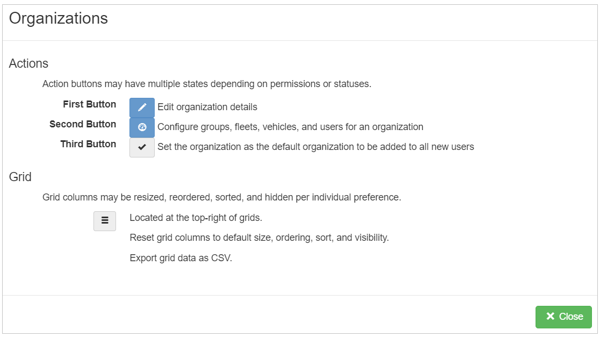

# Wireless neoVI

To begin understanding remote data logging with the Wireless neoVI server and a neoVI hardware connected, the first step is to configure the device and register on our Wireless neoVI server website.

First, connect a PC to the neoVI hardware through 'ETH 02':

<figure>

<figcaption>neoVI FIRE 3 hardware</figcaption>
</figure>

1. Configure the firmware, RTC time, and network baud rate with neoVI Explorer.

Next, on the neoVI hardware itself:

2. Verify the antennas, SIM card, and SDCard \#1 are installed.  
3. Connect the neoVI hardware to DC power and vehicle data bus networks.  
4. Verify the LEDs shows a successful start up of wireless.

Finally, on a PC by itself:

5. Use Vehicle Spy to generate a VS3ZIP script file with desired power management.  
6. Use the Wireless neoVI website Vehicle List to verify the neoVI device is online.  
7. Use the website to send the VS3ZIP script from the PC to the neoVI device.  
8. Use the WiVI website to control, monitor, and transfer data collected by the neoVI device to the PC.

neoVI Explorer configures essential parameters in neoVI hardware to ensure that it works correctly during any mode of operation. Parameters Include its firmware, real time clock(RTC), and vehicle network baud rates, among others. neoVI Explorer MUST run on a PC connected to the neoVI device via the 'ETH 02' port.

<figure>

<figcaption></figcaption>
</figure>

After Explorer is open, your neoVI hardware will show up in the tree on the left.

Clicking the **Connect** button will connect to the device and read its current settings which will be displayed in the area on the right. The status window will indicate any issues while connected to the hardware. 

The firmware versions are displayed on the right and appear as black text if up-to-date and red text if out of date. If needed, the **Manual Reflash** button will update the firmware.

**RTC Time**  
Click **Read RTC** to see the current time of the Real Time Clock. Click **Synchronize RTC** to re-sync the RTC time to the current PC clock time.  

<figure>

<figcaption></figcaption>
</figure>

## Network Settings

To adjust a network setting, like baud rate, click on the proper network in the tree and the area on the right will refresh to show the related settings that can be adjusted. Make sure to click the **Write Settings** button after making changes to push those new settings into the neoVI Connect/RED2/FIRE3. If you make a mistake while changing settings you can click the Load Defaults button to reset ALL Explorer settings in neoVI Explorer back to their defaults.

Using the Wireless neoVI website, devices can be monitored and controlled remotely by a PC. 

## 3.1 Wireless neoVI (WiVI) website {#wireless-neovi-(wivi)-website}

The Wireless neoVI website lets you find, monitor, and control all of your neoVI running in wireless mode from vehicles across the globe. The website server archives log files captured from the vehicles and these files can be downloaded to your PC for further analysis at any time.

This section will show some important settings in the WiVI site

**Log In to Wireless neoVI**  
> Go to ([wirelessneovi.com/](https://preview.wirelessneovi.com/))

Please contact your Wireless neoVI administrator for your website address and account information to get started. After entering your information, click Log In to access your account.  

<figure>

<figcaption>Figure 1: Log In to the Wireless neoVI website.</figcaption>
</figure>

Should you ever forget your password, click the "Forgot Password?" link below the Login button. Answer your security question correctly and you will be allowed to reset your password.

Upon successful login, users will be directed to the homepage, where they can conveniently access sections for managing fleets, vehicles, and loggers. Logger activity is displayed beneath server information and recent downloads, facilitating easy monitoring. Distinct user and administrator roles provide varying levels of access to the platform, with configuration options available in the settings section for customization.

Wireless neoVI website users have access to the menu selections shown in Figure 2\. Administrator accounts have additional managed menu selections.

<figure>

<figcaption>Figure 2: Home Page</figcaption>
</figure>

### 3.1.1 User Information {#user-information}

1) User Dashboard  

<figure>

<figcaption>User Dashboard</figcaption>
</figure>

After clicking on user name →  My Account ↴ shows following information.

2) User Account Information including permission details.

<figure>

<figcaption>User Account Information</figcaption>
</figure>

3) Notifications  
   In this window you will check activity related notifications from wireless neoVI.  

<figure>

<figcaption>User Notification Screen</figcaption>
</figure>

4) Download

	The download related files and other things will show here.

### 3.1.2 Server Information {#server-information}

Users have the ability to view server-related information and manage server settings effortlessly. Additionally, users can download server information with a single click.

1) Overview Menu \- Upon selecting the server, within its menu, you will find "Overview" as a submenu. Here, you can access server overview information, including details such as job queue status, disk storage utilization, and component versions.

<figure>

<figcaption>Overview Menu</figcaption>
</figure>

2) Announcement Menu \- Within this submenu, you can view all announcements posted by users, along with their respective dates. You have the option to edit or delete these announcements. Additionally, you can send messages to all site users simply by typing your message.

<figure>

<figcaption>Announcement Menu</figcaption>
</figure>

3) Audit Logs Menu \- Within this menu, all audit log information is displayed. You can filter the logs by Date Range, User, Entity, and Operation to refine the displayed information. Below is an image showing an overview of the audit logs.

<figure>

<figcaption>Audit Logs Menu</figcaption>
</figure>

4) Data Management → Trending \- Within this submenu, you can view all fleets along with their respective vehicles.

<figure>

<figcaption>All fleets along with their respective vehicles</figcaption>
</figure>

5) Data Management → Usage  

<figure>

<figcaption>Data Management Usage Menu</figcaption>
</figure>

6) Logs \- Within this submenu, you can access all log messages, including API, server, dataspy, distiller, UI, and others.  

<figure>

<figcaption>Logs</figcaption>
</figure>

7) Server Host Information \-   

<figure>

<figcaption>Server Host Information</figcaption>
</figure>

### 3.1.3 Organizations Menu {#organizations-menu}

Upon selecting this menu, you will be presented with a list of organizations and their associated users. This includes details such as the number of fleets, groups, and individual users within each organization.

<figure>

<figcaption>Organizations Menu</figcaption>
</figure>

Upon selecting this menu, you will be presented with a list of organizations and their associated users, along with options to add new organizations by clicking on the  button.

**Help** - When you click on the  Help button, it shows the following description with their respective action.

<figure>

<figcaption></figcaption>
</figure>

**Users** - This helps to add new user in the organization. 

<figure>

<figcaption></figcaption>
</figure>

We can see the Added users, in users dashboard section. (actions, first name, last name, user name, email, last active and disable date etc.)

**Grid button** - In this  button, we can enable or disable column grid layout options. Also able to export the data in csv format.

