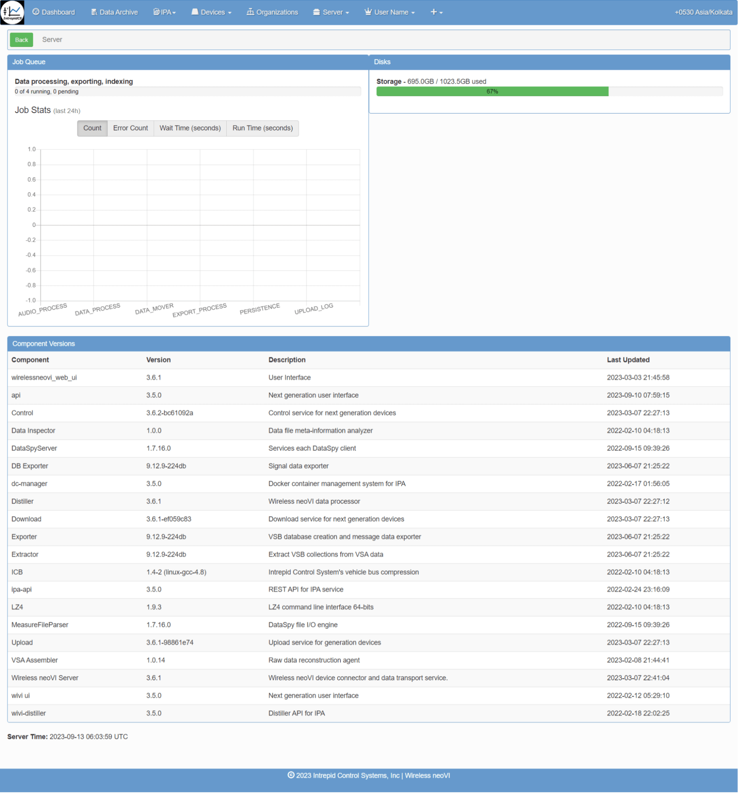
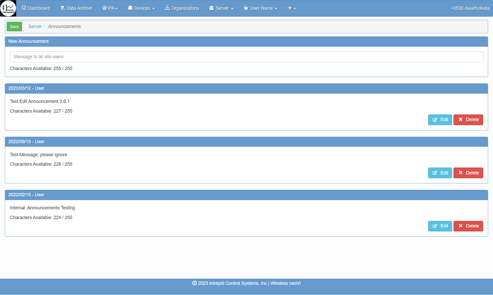

# 3. Wireless neoVI

To begin understanding remote data logging with the Wireless neoVI server and a neoVI hardware connected, the first step is to configure the device and register on our Wireless neoVI server website.

First, connect a PC to the neoVI hardware through 'ETH 02':

<figure>

<figcaption>neoVI FIRE 3 hardware</figcaption>
</figure>

1. Configure the firmware, RTC time, and network baud rate with neoVI Explorer.

Next, on the neoVI hardware itself:

2. Verify the antennas, SIM card, and SDCard \#1 are installed.  
3. Connect the neoVI hardware to DC power and vehicle data bus networks.  
4. Verify the LEDs shows a successful start up of wireless.

Finally, on a PC by itself:

5. Use Vehicle Spy to generate a VS3ZIP script file with desired power management.  
6. Use the Wireless neoVI website Vehicle List to verify the neoVI device is online.  
7. Use the website to send the VS3ZIP script from the PC to the neoVI device.  
8. Use the WiVI website to control, monitor, and transfer data collected by the neoVI device to the PC.

neoVI Explorer configures essential parameters in neoVI hardware to ensure that it works correctly during any mode of operation. Parameters Include its firmware, real time clock(RTC), and vehicle network baud rates, among others. neoVI Explorer MUST run on a PC connected to the neoVI device via the 'ETH 02' port.

<figure>

<figcaption></figcaption>
</figure>

After Explorer is open, your neoVI hardware will show up in the tree on the left.

Clicking the **Connect** button will connect to the device and read its current settings which will be displayed in the area on the right. The status window will indicate any issues while connected to the hardware. 

The firmware versions are displayed on the right and appear as black text if up-to-date and red text if out of date. If needed, the **Manual Reflash** button will update the firmware.

**RTC Time**  
Click **Read RTC** to see the current time of the Real Time Clock. Click **Synchronize RTC** to re-sync the RTC time to the current PC clock time.  

<figure>

<figcaption></figcaption>
</figure>

## Network Settings

To adjust a network setting, like baud rate, click on the proper network in the tree and the area on the right will refresh to show the related settings that can be adjusted. Make sure to click the **Write Settings** button after making changes to push those new settings into the neoVI Connect/RED2/FIRE3. If you make a mistake while changing settings you can click the Load Defaults button to reset ALL Explorer settings in neoVI Explorer back to their defaults.

Using the Wireless neoVI website, devices can be monitored and controlled remotely by a PC. 

## 3.1 Wireless neoVI (WiVI) website {#wireless-neovi-(wivi)-website}

The Wireless neoVI website lets you find, monitor, and control all of your neoVI running in wireless mode from vehicles across the globe. The website server archives log files captured from the vehicles and these files can be downloaded to your PC for further analysis at any time.

This section will show some important settings in the WiVI site

**Log In to Wireless neoVI**  
> Go to ([wirelessneovi.com/](https://preview.wirelessneovi.com/))

Please contact your Wireless neoVI administrator for your website address and account information to get started. After entering your information, click Log In to access your account.  

<figure>

<figcaption>Figure: Log In to the Wireless neoVI website.</figcaption>
</figure>

Should you ever forget your password, click the "Forgot Password?" link below the Login button. Answer your security question correctly and you will be allowed to reset your password.

Upon successful login, users will be directed to the homepage, where they can conveniently access sections for managing fleets, vehicles, and loggers. Logger activity is displayed beneath server information and recent downloads, facilitating easy monitoring. Distinct user and administrator roles provide varying levels of access to the platform, with configuration options available in the settings section for customization.

Wireless neoVI website users have access to the menu selections shown in Figure 2\. Administrator accounts have additional managed menu selections.

<figure>

<figcaption>Figure: Home Page</figcaption>
</figure>

### 3.1.1 User Information {#user-information}

**1\) User Dashboard -**

<figure>

<figcaption>User Dashboard</figcaption>
</figure>

After clicking on user name →  My Account ↴ shows following information.

**2\) User Account Information including permission details -**

<figure>

<figcaption>User Account Information</figcaption>
</figure>

**3\) Notifications -**   
In this window you will check activity related notifications from wireless neoVI.  

<figure>

<figcaption>User Notification Screen</figcaption>
</figure>

**4\) Download -**

	The download related files and other things will show here.

<figure>

<figcaption></figcaption>
</figure>

### 3.1.2 Server Information {#server-information}

Users have the ability to view server-related information and manage server settings effortlessly. Additionally, users can download server information with a single click.

**1) Overview Menu \-** Upon selecting the server, within its menu, you will find "Overview" as a submenu. Here, you can access server overview information, including details such as job queue status, disk storage utilization, and component versions.

<figure>

<figcaption>Overview Menu</figcaption>
</figure>

**2) Announcement Menu \-** Within this submenu, you can view all announcements posted by users, along with their respective dates. You have the option to edit or delete these announcements. Additionally, you can send messages to all site users simply by typing your message.

<figure>

<figcaption>Announcement Menu</figcaption>
</figure>

**3) Audit Logs Menu \-** Within this menu, all audit log information is displayed. You can filter the logs by Date Range, User, Entity, and Operation to refine the displayed information. Below is an image showing an overview of the audit logs.

<figure>

<figcaption>Audit Logs Menu</figcaption>
</figure>

**4) Data Management → Trending \-** Within this submenu, you can view all fleets along with their respective vehicles.

<figure>

<figcaption>All fleets along with their respective vehicles</figcaption>
</figure>

**5) Data Management → Usage**  

<figure>

<figcaption>Data Management Usage Menu</figcaption>
</figure>

**6) Logs \-** Within this submenu, you can access all log messages, including API, server, dataspy, distiller, UI, and others.  

<figure>

<figcaption>Logs</figcaption>
</figure>

**7) Server Host Information \-**

<figure>

<figcaption>Server Host Information</figcaption>
</figure>

### 3.1.3 Organizations Menu {#organizations-menu}

Upon selecting this menu, you will be presented with a list of organizations and their associated users. This includes details such as the number of fleets, groups, and individual users within each organization.

<figure>

<figcaption>Organizations Menu</figcaption>
</figure>

Upon selecting this menu, you will be presented with a list of organizations and their associated users, along with options to add new organizations by clicking on the  button.

**Help** - When you click on the  Help button, it shows the following description with their respective action.

<figure>

<figcaption></figcaption>
</figure>

**Grid button** - In this  button, we can enable or disable column grid layout options. Also able to export the data in `.csv` format.

**Users** - This helps to add new user in the organization. 

<figure>

<figcaption></figcaption>
</figure>

We can see the Added users, in users dashboard section. (actions, first name, last name, user name, email, last active and disable date etc.)

### 3.1.4 Devices Menu {#devices-menu}

When you click on this menu, it shows the following types of submenus.

1) ** Overview** \- This section provides an overview of devices, displaying Actions (Info, Edit, Assign Device, Delete Device), License status, Type, Serial Number, Vehicle association, Script, and SMS information. Users can view columns individually, sorting them in ascending or descending order. Additionally, columns can be hidden as needed. A search function allows users to find specific device types, serial numbers, vehicles, scripts, and SMS details. Data can be exported in CSV format by clicking the grid button for further analysis.

2) ** Component Versions** \-Component Versions \- This section provides comprehensive information on device component versions, including device name, Android version, APK file version, MPIC version, SIM status (presence and IMEI if available), Vspy Compiler version (Vspy software), and last update details. The grid options allow users to enable specific details such as Core FPGA, Coremini, Coremini Size, HID, ICB, HW Rev, LPIC, Modern IMEI, FCHIP, MCHIP, ZCHIP, MPIC Bl, SIM ICCID, Access Point MAC, WiFi MAC, and more as required. Users can export all data in CSV format by clicking the grid button for further analysis and reporting.  
     
     
3) ** Send to Device** \- This feature enables users to upload files to the WiVI server. Users can upload files with valid extensions such as `.wivi`, `.kitt`, `.apk`, `.wnc`, and `.iup`. During the upload process, users can provide a description for the uploaded file. 

<figure>

<figcaption></figcaption>
</figure>

4) ** Update History** \- Upon selection, this section displays the history of uploads, including script file names, descriptions, number of associated devices, user names, and other relevant details. Users can export all data in CSV format by clicking the grid button for further analysis and reporting.  

### 3.1.5 IPA (Integrated Post Analysis) Menu {#ipa-(integrated-post-analysis)-menu}

The IPA (Integrated Post Analysis) service, integrated within Wireless neoVI, facilitates the execution of Python scripts on both static datasets from the data archive and dynamically on live data for analysis purposes. This document aims to dissect the IPA components, outlining the intended usage of each component and the service as a whole.

The IPA menu includes several submenus:

   1. Results: Displays the outcomes and outputs generated from executed Python scripts.  
   2. Analyzers: Provides tools and functionalities to create, manage, and execute Python analyzers for specific data analysis tasks.  
   3. Scripts: Allows users to upload, manage, and execute Python scripts for customized data processing and analysis.  
   4. Data Sets: Provides access to static datasets stored in the data archive for analysis using Python scripts.  
   5. Run Queue: Shows the queue of Python scripts scheduled or currently running, providing status and progress updates.  
   6. How it Works: Offers an explanation and overview of the IPA service, detailing its functionality, capabilities, and integration within the Wireless neoVI platform.

> 1) **Results** \- This shows the IPA results with search and filter option like date range. Also user can export the data in .csv and `.xlsx` format.  

<figure>

<figcaption></figcaption>
</figure>

> 2) **Analyzers** \- Analyzers are central to IPA and encompass several key components. They are designed for easy creation and editing by the user who initiates them. To create an analyzer, navigate to IPA \> Analyzer in the navigation bar and click the "Generate" button. This action prompts you to specify the components required for an Analyzer. 

An Analyzer must include:

* Name: A descriptive title for the analyzer.  
* Run Type: Either "Dynamic" or "Static", indicating whether the analysis is performed on live data as it's uploaded ("Dynamic") or on pre-existing datasets ("Static").  
* Analysis Script: The Python script that defines the analysis to be performed.  
* Dataset: The dataset(s) on which the analysis script will operate.  
* Configurations: Optional settings that customize the behavior of the analysis.  
* Users: Optionally, users with whom results should be automatically shared upon completion.

An analyzer can incorporate multiple analysis scripts, datasets, configurations, and users.

Once created, analyzers are listed on the Analyzer page grid. To run a static analyzer, simply click the run icon next to its entry on the grid. This action initiates a new run in the RunQueue, marked with a status of "New". The IPA Scanner picks up this task, launching a container with all necessary information. The selected analysis script runs on the chosen dataset(s), and results are subsequently displayed on the Results page.

If any issues arise during processing, such as container or script errors, a DockerLog.txt file appears in the results section, containing the error details.

For dynamic datasets, activate them by clicking the green "active" check mark on the grid. This designation ensures that new uploads are automatically evaluated against dataset criteria. Matches trigger the designated analysis process accordingly.

You can create new Analyzers by using the  button. The Analyzer page provides an overview of all analyzers, displaying details such as the Action (options to edit or delete), Name (descriptive title), Description (brief overview), Type (Dynamic or Static), Script Name (Python script used), Configuration (custom settings), Data Sets (associated datasets), Last Status (current run status), and User (creator). 

Users can search for specific analyzers and apply filters as needed. The last status updates automatically based on the completion status of the most recent run.

<figure>

<figcaption></figcaption>
</figure>

<figure>

<figcaption></figcaption>
</figure>

> 3) **Scripts** \- Analysis Scripts are the data processor assigned to an Analyzer. Users can see all Analyzer Scripts available to their organization. All users can upload Analyzer Scripts but it cannot be used by anyone until reviewed and approved by an administrator. AnalyzerScripts can be deleted by their owner and administrators. Scripts may be written in Python (R support may be added in the future). This will allow the user to add specified script to use on server. 

<figure>

<figcaption></figcaption>
</figure>

Also the uploaded script can be reconfigure again or delete. User can export the data in `.csv` and `.xlsx` format. 

<figure>

<figcaption></figcaption>
</figure>

After clicking on the configuration button  it shows following.

<figure>

<figcaption></figcaption>
</figure>

Here User can download the script file, delete file and also be able to view the data in that file in json format. Inside this user can upload a new configuration file.

<figure>

<figcaption></figcaption>
</figure>

**Configurations**:

Configurations are optional for Analyzers but can be used to configure the operation of an Analysis Script based on parameters contained within.

It could be as simple as passing a parameter to make a different method in the script run or as complex as to dictate what to search for in the data.

> 4) **Data Sets** \-  Data Sets define the source data passed to your Analyzer. Data Sets can be generated either by selecting criteria, or by selecting specific files from the data query.

**Files**

Simply navigate to Generate page, perform a search, select your desired files and click "Create DataSet".  
This will generate a Static Data Set which can be used for on demand Analysis.

**Criteria**

A dynamic Data Set is a collection of criteria in any combination or number of:

* Fleets and/or Vehicles  
* Collections and/or file names  
* File extensions  
* Dates  
* Scripts

These Data Sets must be either Static, which are used for on demand analysis on existing files, or Dynamic, which are used for ongoing analysis of files as they are collected.

You may assign multiple Data Sets to an Analyzer so there is no need to create or maintain a single all-inclusive Data Set.

Data Sets created by you are only available to you so may add, edit, or discard them at any time.

<figure>

<figcaption></figcaption>
</figure>

After clicking on  Add button; the search criteria will showing and in this user can select Fleets/Vehicles using check boxes, also selecting Start Date/Time and End Date/Time. User can export the data as well.

<figure>

<figcaption></figcaption>
</figure>

There are two types of datasets, static and dynamic, that can be used with IPA.

A Static Dataset consists of the specific files the dataset creator has chosen or via specific criteria. These datasets can be created in the data archive by selecting the files and choosing “Create Data Set”; they can also be created via the generate page. To do so, select the expected criteria, and make sure the selected type is “Static”.

Analyzing the files in a Static Dataset is a one time process done by simply selecting the Dataset for an Analyzer and clicking the “Run” icon on the Analyzers page.

A Dynamic Dataset consists of search criteria to match files against, instead of specific files. For example, when creating a Dynamic Dataset you could simply specify a vehicle, and the dataset would entail every collection associated with that vehicle, as opposed to going and selecting all the files associated with that vehicle yourself. Dynamic Data Sets at the moment can only match against future uploads.The analysis will be run on incoming collections as long as the Dataset is active. Activating the in a Dynamic Dataset is done by simply selecting the Dataset for an Analyzer and clicking the “Active” icon on the Analyzers.

> 5) **Run Queue**  \- The Run Queue is used for observing and managing existing and previous “Runs”, AKA a time when an Analyzer has tried to apply an Analysis Script(s) to Dataset(s). 

Runs can be canceled by selecting the check mark associated with the row and then selecting Actions \> Cancel Selected. This will kill the container that is being run and end the analysis where it was taking place. Canceling will only work if the Run has a status of “NEW” or “STARTED”.

Runs can be deleted from the queue by selecting the check mark associated with the row and then selecting Actions \> Delete Selected. These runs will not be deleted if the status is not “NEW” or “STARTED”, you must cancel them first. 

It shows the available analyzers, Job name, Result Id, Status, Created At, Started, Finished, User name and Exit Payload etc. The user is then able to export the available data in `.csv format` and `.xlsx format`.  

<figure>

<figcaption></figcaption>
</figure>

### 3.1.6 Data Archive {#data-archive}

<figure>

<figcaption></figcaption>
</figure>

This menu shows the selected Fleets/Vehicles data. Users can select the fleets with Date Range (Start Date and End Date with Start Time and End TIme). Users can sort according to File Types. 

After selecting the options all data shows like Start Date, End Date, Vehicle, Name, Upload Id, View and Data Type etc. 

### 3.1.7 Dashboard Menu {#dashboard-menu}

<figure>

<figcaption></figcaption>
</figure>

In this dashboard menu users can check all the fleets and vehicles that are available in the server as per organization. Also able to check how much server load, recent downloads and logger activity. User can add new fleets and new vehicles through this on clicking   and 

When you click on any available vehicle or fleet, it shows the live status of that vehicle where it is located using google maps. Also it shows the exact speed of the vehicle and device connected to the vehicle with the last connected date and time. And the longitude and latitude on google maps. Users can switch it to satellite view as well as map view.

Users are able to see which device is assigned to that vehicle/fleet. Also show the status of the device whether it is connected or disconnected. Below that is the external IP address and Local IP address there. User can download the script file by clicking on script file which is .vs3zip extension if you want to send script file to that device user just needs to click  icon.

After that a pop up window open and shows **VehicleSpy version, Uploaded date and time, Description of the file, Size, CoreMini 16-bit and CoreMini 32-bit, Files history till current date and in last on which Vehicle has file is send, connected Device name and when it Scheduled, also shows Progress of that. Below is the example for the same.**  

<figure>

<figcaption></figcaption>
</figure>

In the below when you click on Data. The data section shows the Data Archive, Pending Uploads, Manual Uploads From Device, Upload Data From PC, Export Settings etc.

**Data Archive \-** When you click on this menu, it redirects to the Data Archive menu. In this we can see the selected Fleets/Vehicles data. Users can select the fleets with Date Range (Start Date and End Date with Start Time and End TIme). Users can sort according to File Types. 

After selecting the options all data shows like Start Date, End Date, Vehicle, Name, Upload Id, View and Data Type etc. 

**Pending Uploads \-**  When you click on pending uploads, it shows the pending uploads of files.

<figure>

<figcaption></figcaption>
</figure>

